# OTA

# 环形指针

# USART 配置（包含 DMA）
## 引脚
1. 引脚配置
	
2. 引脚模式配置
	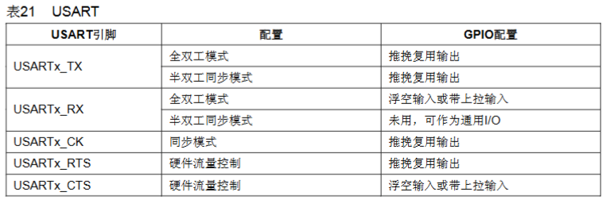
3. 地址
	- USART1 范围：0x4001 3800 - 0x4001 3BFF （参考手册 表 1）
	- USART1_BASE ：0x4001 3800
	- DR 偏移地址：0x04  （参考手册 p 541）
	- `&(USART1->DR) = USART1_BASE + 0x40 = 0x40013800 + 0x04 = 0x40013804`

## 传输
##### 传输格式
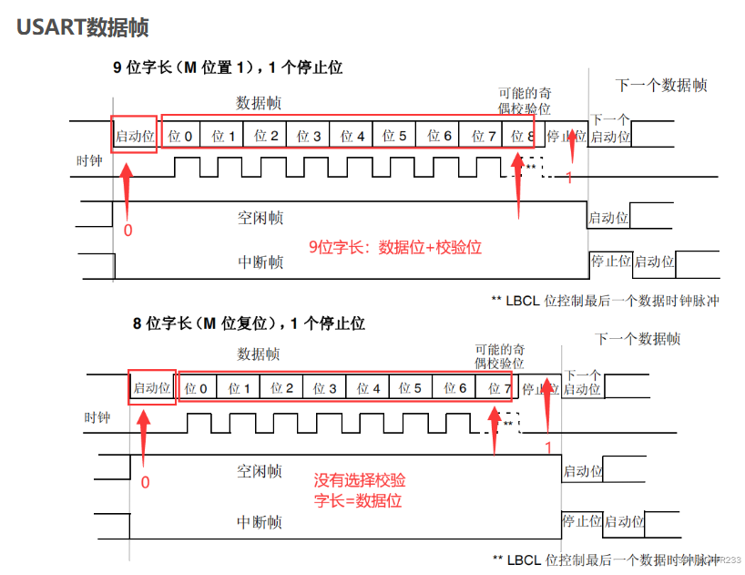
数据帧组成：起始位+数据位+校验位+停止位  
1、起始位：**目的是告知接收方接收数据，0 有效**  
2、数据位：可以被编程（5,6,7,8），一般选择 8 位字长可以编程：数据位+校验位  
3、校验位：奇偶校验位  
4、停止位：可以被编程
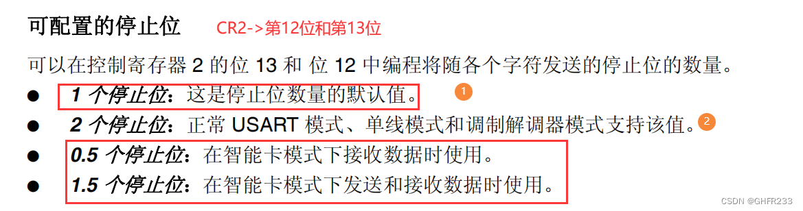

接收端如何检测起始位
步骤：
1. **空闲检测**    
    - 接收线在空闲时是高电平        
    - USART 硬件持续监控 RX 引脚        
2. **下降沿检测**    
    - 当 RX 从高电平变为低电平 → 发现起始位        
    - USART 硬件开始定时器，称为 **采样计时器**        
3. **采样中点**    
    - **每个比特时间为 `1 / 波特率`**        
    - USART 不是立即读取 RX，而是 **在比特中点采样**        
    - 例如 115200bps → 每比特时间约 8.68 μs        
    - 起始位中点采样确认为低 → 确认帧开始

数据位采样
- 起始位采样完成后，硬件在每个比特中点采样 RX    
- 数据位按顺序采样 0~7（LSB 先）    
- 采样结果存入接收寄存器 (`USARTx->DR`)

停止位判断
- 数据位采完后，硬件采样停止位    
- 如果 RX 高电平持续至少一个比特时间 → 停止位有效    
- 停止位完成 → 一帧接收完成，USART 设置 `RXNE` 标志位

在 STM32 的 USART 硬件中：
1. **RX 空闲状态** → RX 高
2. **起始位下降沿检测** → USART 内部定时器启动
3. **采样中点** → 判断起始位是否有效
4. **依次采样数据位**
5. **采样停止位** → 校验是否正确
6. **产生中断** → `USART_IT_RXNE` 或 DMA 接收

> 所以 USART **不需要 CPU 计算起始位结束时间**，全由内部采样时钟控制
## 中断
###  UART 空闲中断（IDLE Line Interrupt）是什么？
> **UART 空闲中断用于检测一帧数据是否结束。**  
> 当 UART 在 RX 线上 **一个字节时间内没有新数据到来** → 触发 IDLE 中断。

场景：
- DMA 接收不定长数据（常见：Modbus、ESP8266、AT 指令等）
- 不需要每个字节都进中断
- 自动判断“本帧结束”
### 空闲中断的触发条件（非常重要）

IDLE 触发条件：

> **UART 在收到至少 1 个字节后，在一个帧的时长内没有再收到新字节**

比如：
115200 波特率 → 1 字节时间 = 1 / 115200 * 10bit ≈ **87µs**
若 87µs 内没有新数据 → 空闲中断触发。
### 空闲中断的寄存器位

|功能|寄存器|位|
|---|---|---|
|空闲中断标志|USART_SR|**IDLE (bit 4)**|
|空闲中断使能|USART_CR1|**IDLEIE (bit 4)**|

### 开启空闲中断（标准库）

1. 开启 UART 空闲中断（CR1）
```cpp
USART_ITConfig(USART1, USART_IT_IDLE, ENABLE);
```
2. 开启 NVIC
```cpp
NVIC_InitTypeDef NVIC_InitStructure;
NVIC_InitStructure.NVIC_IRQChannel = USART1_IRQn;
NVIC_InitStructure.NVIC_IRQChannelPreemptionPriority = 1;
NVIC_InitStructure.NVIC_IRQChannelSubPriority = 1;
NVIC_InitStructure.NVIC_IRQChannelCmd = ENABLE;

NVIC_Init(&NVIC_InitStructure);
```
3.  UART 空闲中断处理函数（最关键）
	**⚠ 必须读 SR → DR 来清除 IDLE 标志，否则中断会一直进入。**
```cpp
void USART1_IRQHandler(void)
{
    /* 空闲中断 */
    if (USART_GetITStatus(USART1, USART_IT_IDLE) != RESET)
    {
        volatile uint32_t temp;

        /* 必须先读 SR 再读 DR 清除 IDLE 标志 */
        temp = USART1->SR;
        temp = USART1->DR;
        (void)temp;

        /* ---- 这里处理接收完成 ---- */
        UART_IDLE_Callback();
    }
}
```


## 测试代码
```c
if (UxCB.URxDataOUT != UxCB.URxDataIN) // 有数据可读
{
    printf("Received data %d bytes: ", UxCB.URxDataOUT->end - UxCB.URxDataOUT->start + 1);
    for (uint8_t *ptr = UxCB.URxDataOUT->start; ptr <= UxCB.URxDataOUT->end; ptr++)
    {
        printf("%c", *ptr);
    }
    UxCB.URxDataOUT++; // 指向下一个段的地址
    if (UxCB.URxDataOUT == UxCB.URxDataEND)
        UxCB.URxDataOUT = &UxCB.URxDataPtr[0]; // 移动到第一个段的地址
}
```

## OTA 代码
```cpp
#ifndef __USER_USART_H__
#define __USER_USART_H__

#include "stm32f10x.h"
#include <stdio.h>

#ifndef USARTx
#define USARTx USART1
#define USARTTx GPIO_Pin_9
#define USARTRx GPIO_Pin_10
#define GPIOx GPIOA
#define DMAx DMA1
#define USART_DMA_TX_CH DMA1_Channel4 // USART1 TX
#define USART_DMA_RX_CH DMA1_Channel5 // USART1 RX
// #define USART_DMA_TX_CH   DMA1_Channel6 // USART2 TX
// #define USART_DMA_RX_CH   DMA1_Channel7 // USART2 RX
// #define USART_DMA_TX_CH   DMA1_Channel2 // USART3 TX
// #define USART_DMA_RX_CH   DMA1_Channel3 // USART3 RX
#endif

#define U_TX_SIZE   2048    // 环形缓冲区总大小（字节数）
#define U_RX_SIZE   2048    // 环形缓冲区总大小（字节数）
#define U_RX_MAX    256     // 每次单独接收最大字节数
#define NUM         10      // 分段缓冲区数量

/**
 * @brief  表示环形缓冲区中的一段连续内存
 * @note   start: 段起始地址
 *         end:   段结束地址
 *         一个环形缓冲区由 NUM 个段组成
 */
typedef struct {
    uint8_t *start;   // 段起始地址
    uint8_t *end;     // 段结束地址
} UCB_URxBuffPtr;

/**
 * @brief  环形缓冲区控制结构
 * @note
 *  - URxDataPtr[NUM] : 保存每个段的起始和结束地址
 *  - URxDataIN       : DMA 或串口写入指针，写入数据时向前移动
 *                      到达缓冲区末尾时回绕到起始地址，实现循环
 *  - URxDataOUT      : 应用程序读取指针，读取数据后向前移动
 *  - URxDataEND      : 缓冲区末尾地址，用于判断回绕
 *  - URxCount        : 当前缓冲区有效数据量，可判断空或满
 */
typedef struct {
    UCB_URxBuffPtr URxDataPtr[NUM];  // 分段缓冲区数组
    UCB_URxBuffPtr *URxDataIN;               // 写入指针（DMA/串口接收）
    UCB_URxBuffPtr *URxDataOUT;              // 读取指针（应用程序）
    UCB_URxBuffPtr *URxDataEND;              // 缓冲区末尾指针
    uint32_t URxCount;                // 当前缓冲区有效数据量(字节数)
} UCB_CB;


void User_USART_Init(void);
void USARTx_IRQHandler(void);
extern UCB_CB UxCB;

#endif /* __UASRT_H__ */

```

```cpp
#include "stm32f10x.h"
#include "UserUSART.h"
#include <stdio.h>

uint8_t URxBuffer[U_RX_SIZE]; // 接收缓冲区
UCB_CB UxCB;

void UxCB_Init(void);
void User_DMA_Init(void);

void User_USART_Init(void)
{

    // 配置 NVIC 中断
    NVIC_InitTypeDef NVIC_InitStruct;
    if (USARTx == USART1)
        NVIC_InitStruct.NVIC_IRQChannel = USART1_IRQn;
    else if (USARTx == USART2)
        NVIC_InitStruct.NVIC_IRQChannel = USART2_IRQn;
    else if (USARTx == USART3)
        NVIC_InitStruct.NVIC_IRQChannel = USART3_IRQn;

    NVIC_InitStruct.NVIC_IRQChannelPreemptionPriority = 0;
    NVIC_InitStruct.NVIC_IRQChannelSubPriority = 0;
    NVIC_InitStruct.NVIC_IRQChannelCmd = ENABLE;
    NVIC_Init(&NVIC_InitStruct);

    if (GPIOx == GPIOA)
        RCC_APB2PeriphClockCmd(RCC_APB2Periph_GPIOA, ENABLE);
    else if (GPIOx == GPIOB)
        RCC_APB2PeriphClockCmd(RCC_APB2Periph_GPIOB, ENABLE);
    else if (GPIOx == GPIOC)
        RCC_APB2PeriphClockCmd(RCC_APB2Periph_GPIOC, ENABLE);

    RCC_APB2PeriphClockCmd(RCC_APB2Periph_GPIOA, ENABLE);
    GPIO_InitTypeDef GPIO_InitStruct = {0};
    GPIO_InitStruct.GPIO_Mode = GPIO_Mode_AF_PP;
    GPIO_InitStruct.GPIO_Pin = USARTTx;
    GPIO_InitStruct.GPIO_Speed = GPIO_Speed_50MHz;
    GPIO_Init(GPIOx, &GPIO_InitStruct);
    GPIO_InitStruct.GPIO_Mode = GPIO_Mode_IPU;
    GPIO_InitStruct.GPIO_Pin = USARTRx;
    GPIO_InitStruct.GPIO_Speed = GPIO_Speed_50MHz;
    GPIO_Init(GPIOx, &GPIO_InitStruct);

    if (USARTx == USART1)
        RCC_APB2PeriphClockCmd(RCC_APB2Periph_USART1, ENABLE);
    else if (USARTx == USART2)
        RCC_APB1PeriphClockCmd(RCC_APB1Periph_USART2, ENABLE);
    else if (USARTx == USART3)
        RCC_APB1PeriphClockCmd(RCC_APB1Periph_USART3, ENABLE);

    USART_InitTypeDef USART_InitStruct = {0};
    USART_InitStruct.USART_BaudRate = 115200;
    USART_InitStruct.USART_HardwareFlowControl = USART_HardwareFlowControl_None;
    USART_InitStruct.USART_Mode = USART_Mode_Tx | USART_Mode_Rx;
    USART_InitStruct.USART_Parity = USART_Parity_No;
    USART_InitStruct.USART_StopBits = USART_StopBits_1;
    USART_InitStruct.USART_WordLength = USART_WordLength_8b;
    USART_Init(USARTx, &USART_InitStruct);

    // 使能串口 IDLE 中断
    USART_ITConfig(USARTx, USART_IT_IDLE, ENABLE);
    // USART_ITConfig(USARTx, USART_IT_RXNE, ENABLE);

    UxCB_Init();
    User_DMA_Init();
    USART_Cmd(USARTx, ENABLE);
}

void USARTx_IRQHandler(void)
{
    if (USART_GetITStatus(USARTx, USART_IT_IDLE) == SET)
    {
        // 清空中断需要读取状态寄存器和数据寄存器
        (void)USARTx->SR; // 读取状态寄存器
        (void)USARTx->DR; // 读取数据寄存器

        // DMA 初始化时设置的总数据量为 `DMA_BufferSize`， 传输过程中，这个值会递减
        UxCB.URxCount += U_RX_MAX + 1 - DMA_GetCurrDataCounter(USART_DMA_RX_CH);
        // URxDataIN 指向当前段的起始地址
        UxCB.URxDataIN->end = &URxBuffer[UxCB.URxCount - 1]; // 设置当前段的结束地址
        UxCB.URxDataIN++;                                    // 指向下一个段的地址
        if (UxCB.URxDataIN == UxCB.URxDataEND)
            UxCB.URxDataIN = &UxCB.URxDataPtr[0]; // 移动到第一个段的地址

        if (U_RX_SIZE - UxCB.URxCount >= U_RX_MAX)             // 确保下一个段有足够空间
            UxCB.URxDataIN->start = &URxBuffer[UxCB.URxCount]; // 0 ~ UxCB.URxCount-1是已接收数据
        else
        {
            UxCB.URxDataIN->start = URxBuffer;
            UxCB.URxCount = 0;
        }

        DMA_Cmd(USART_DMA_RX_CH, DISABLE);
        DMA_SetCurrDataCounter(USART_DMA_RX_CH, U_RX_MAX + 1);   // 设置本次搬运数据量
        USART_DMA_RX_CH->CMAR = (uint32_t)UxCB.URxDataIN->start; // 重设 DMA 内存起始地址
        DMA_Cmd(USART_DMA_RX_CH, ENABLE);
    }
}

void UxCB_Init(void)
{
    UxCB.URxDataIN = &UxCB.URxDataPtr[0];          // 指向第一个段的地址
    UxCB.URxDataOUT = &UxCB.URxDataPtr[0];         // 指向第一个段的地址
    UxCB.URxDataEND = &(UxCB.URxDataPtr[NUM - 1]); // 指向最后一个段的地址
    UxCB.URxDataIN->start = URxBuffer;
    UxCB.URxCount = 0;
}

int fputc(int ch, FILE *f)
{
    // 1.发送数据寄存器为空
    while (USART_GetFlagStatus(USARTx, USART_FLAG_TXE) == RESET)
        ;
    // 2.写入数据到数据寄存器, int 类型转换为字节类型
    USART_SendData(USARTx, (uint8_t)ch);
    return ch;
}

void User_DMA_Init(void)
{
    if (DMAx == DMA1)
        RCC_AHBPeriphClockCmd(RCC_AHBPeriph_DMA1, ENABLE); // 开启DMA时钟
    else if (DMAx == DMA2)
        RCC_AHBPeriphClockCmd(RCC_AHBPeriph_DMA2, ENABLE); // 开启DMA时钟

    // 指定 DMA 通道恢复成上电复位状态——寄存器全部清零，所有中断、使能、优先级、数据宽度、地址等配置擦除。
    DMA_DeInit(USART_DMA_TX_CH); // 串口发送DMA通道
    DMA_DeInit(USART_DMA_RX_CH); // 串口接收DMA通道

    DMA_InitTypeDef DMA_InitStructure;
    DMA_InitStructure.DMA_PeripheralBaseAddr = (uint32_t)(&USARTx->DR);
    DMA_InitStructure.DMA_MemoryBaseAddr = (uint32_t)URxBuffer;
    DMA_InitStructure.DMA_DIR = DMA_DIR_PeripheralSRC;               // 串口数据(外设)到内存
    DMA_InitStructure.DMA_BufferSize = U_RX_MAX + 1;                 // 无须DMA完成中断，因此设置为单次接收数据个数（字节）最大值加1
    DMA_InitStructure.DMA_PeripheralInc = DMA_PeripheralInc_Disable; // 串口地址不会变，无须自增
    DMA_InitStructure.DMA_MemoryInc = DMA_MemoryInc_Enable;          // 内存地址会变，需要自增
    DMA_InitStructure.DMA_PeripheralDataSize = DMA_PeripheralDataSize_Byte;
    DMA_InitStructure.DMA_MemoryDataSize = DMA_MemoryDataSize_Byte;
    DMA_InitStructure.DMA_Mode = DMA_Mode_Normal;         // 无须回到内存起始地址，因为是连续接收数据
    DMA_InitStructure.DMA_Priority = DMA_Priority_Medium; // 中等优先级
    DMA_InitStructure.DMA_M2M = DMA_M2M_Disable;          //
    DMA_Init(USART_DMA_RX_CH, &DMA_InitStructure);

    DMA_Cmd(USART_DMA_RX_CH, ENABLE); // 使能 DMA 接收通道

    USART_DMACmd(USARTx, USART_DMAReq_Rx, ENABLE); // 当 USART 收到数据时，会发出 DMA 请求，让 DMA 自动从 DR 寄存器读取数据。
}

```
# DMA 配置
## 通道
1. DMA1
		
	2. DMA2
		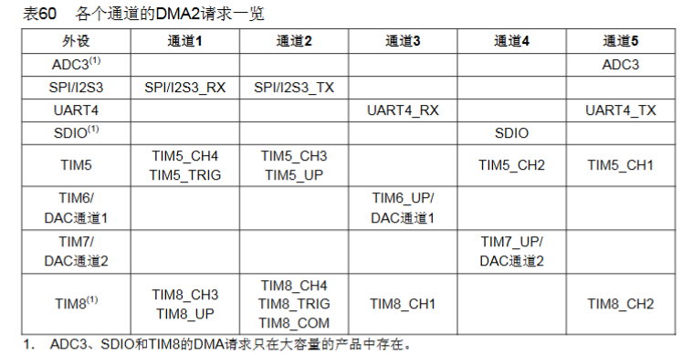


## DMA 传输种类

| 类型      | 描述                         |
| ------- | -------------------------- |
| 外设 → 内存 | ADC、串口接收                   |
| 内存 → 外设 | 串口发送、DAC                   |
| 内存 → 内存 | 快速内存复制，必须设置 `M2M = ENABLE` |

`DMA_DIR_PeripheralSRC`：外设 → 内存（如 ADC）  
`DMA_DIR_PeripheralDST`：内存 → 外设（如 USART 发送）

| 传输模型                         | DMA_DIR               | DMA_M2M   | 说明                 |
| ---------------------------- | --------------------- | --------- | ------------------ |
| **外设 → 内存**（ADC、USART RX 等）  | DMA_DIR_PeripheralSRC | ❌ Disable | 数据源是外设寄存器，必须依外设触发  |
| **内存 → 外设**（USART TX、SPI TX） | DMA_DIR_PeripheralDST | ❌ Disable | 数据目标是外设寄存器，必须依外设触发 |
| **内存 → 内存**（M2M copy）        | 任意                    | ✔ Enable  | 两地址都是内存，与外设无关      |

## DMA_InitTypeDef初始化结构体
		
```cpp
void DMA_MTM_Config(void)
{
	/*定义DMA初始化结构体*/
	DMA_InitTypeDef DMA_InitStruct;
	/*打开DMA外设时钟，DMA挂载在AHB总线时钟上*/
	RCC_AHBPeriphClockCmd(DMA_MTM_CLK, ENABLE);
	/*设置外设基地址，即源地址*/
	DMA_InitStruct.DMA_PeripheralBaseAddr =	(uint32_t) aSRC_Const_Buffer;
	/*设置目标存储器地址，即目标地址*/
	DMA_InitStruct.DMA_MemoryBaseAddr	  =	(uint32_t) aDST_Buffer;
	/*配置传输方向，这里为止解决的是从哪里来，到哪里去*/
	DMA_InitStruct.DMA_DIR 				  =	DMA_DIR_PeripheralSRC;
	/*设置要传输的数量*/
	// DMA 要搬运的 **数据个数**- 单位取决于 DataSize（Byte/HalfWord/Word）
	// DMA_BufferSize 减到 0 → 硬件置位内部 **TC（Transfer Complete）** 标志；
	DMA_InitStruct.DMA_BufferSize		  =	BUFFER_SIZE;
	/*设置外设的字宽*/
	DMA_InitStruct.DMA_PeripheralDataSize =	DMA_PeripheralDataSize_Word;
	/*外设地址是否自增*/
	DMA_InitStruct.DMA_PeripheralInc	  =	DMA_PeripheralInc_Enable;
	/*存储器地址是否自增*/
	DMA_InitStruct.DMA_MemoryInc		  =	DMA_MemoryInc_Enable;
	/*存储器数据宽度 - 目标端的数据宽度 - 设置为 32bit，与源端一致 → 正确。*/
	DMA_InitStruct.DMA_MemoryDataSize	  =	DMA_MemoryDataSize_Word;
	/*设置传输模式是一次性传输，还是循环传输*/
	// Circular：传输完自动返回起点（常用于 ADC 连续传输）
	// 重新回到起始地址
	DMA_InitStruct.DMA_Mode				  =	DMA_Mode_Normal;
	/*设置优先级*/
	DMA_InitStruct.DMA_Priority			  =	DMA_Priority_High;
	/*开启存储器到存储器传输*/
	// 存储器到存储器必须开启，否则 M2M 复制无法进行 - 开启后 DMA 不依赖外设触发，可自行运行。
	DMA_InitStruct.DMA_M2M				  =	DMA_M2M_Enable;
	/*DMA初始化*/
	DMA_Init(DMA_MTM_CHANNEL, &DMA_InitStruct);
	/*打开DMA通道*/
	DMA_Cmd(DMA_MTM_CHANNEL,  ENABLE);
 }
```


## DMA 中断

> **DMA 中断需要：DMA_ITConfig 开启控制位 + NVIC_Init 开启 NVIC 通道**  
> **TC/HT/TE 三种中断分别对应 TCIFx、HTIFx、TEIFx 标志位。**
### 标志位说明

| 中断事件       | 标志位（状态寄存器）                         | 控制位（使能寄存器）                             | 说明                     |
| ---------- | ---------------------------------- | -------------------------------------- | ---------------------- |
| **传输完成中断** | `TCIFx`，**不会自动触发中断**，除非 `TCIE` 被使能 | `TCIE`，控制 DMA 是否在 `TCIFx` 置位时 **触发中断** | 完成全部缓冲区传输时触发           |
| **半传输中断**  | `HTIFx`                            | `HTIE`                                 | 完成一半传输时触发（常用于双缓冲/流式处理） |
| **传输错误中断** | `TEIFx`                            | `TEIE`                                 | DMA 发现错误时触发（优先级最高）     |
|            |                                    |                                        |                        |

1. 什么时候用半传输中断（HTIE）？
	- 双缓冲数据处理
	- 串口长帧接收（DMA + HT 中断）
	- 音频数据流连续采样（ADC + DMA + HT）
	- 处理“前半段时处理前半缓冲，后半段处理后半缓冲”
	如果只需要一次性传输或环形传输→通常只开 **TCIE**。

2. 什么时候用传输错误中断（TEIE）？
	几乎所有项目都建议开启：`DMA_IT_TE`，可以发现：
	- 地址越界
	- 配置错误
	- DMA 未正确使能外设触发

### 启用 DMA 中断的流程

DMA 中断必须 **同时开启两个地方**：
1. DMA 本身的中断控制位
	```cpp
	DMA_ITConfig(DMA_ChannelX, DMA_IT_TC, ENABLE);  // 传输完成中断
	DMA_ITConfig(DMA_ChannelX, DMA_IT_HT, ENABLE);  // 半传输中断 
	DMA_ITConfig(DMA_ChannelX, DMA_IT_TE, ENABLE);  // 传输错误中断
	```
	示例：
	`DMA_ITConfig(DMA1_Channel1, DMA_IT_TC | DMA_IT_TE, ENABLE);`

2. NVIC 中断使能
	DMA 中断属于 Cortex-M NVIC，需要配置：
	```cpp
	NVIC_InitTypeDef NVIC_InitStructure; // 定义 NVIC 初始化结构体
	NVIC_InitStructure.NVIC_IRQChannel = DMA1_Channel1_IRQn; // 选择中断源：DMA1 通道1
	NVIC_InitStructure.NVIC_IRQChannelPreemptionPriority = 1; // 抢占优先级 1（0~15，数值越小越优先）
	NVIC_InitStructure.NVIC_IRQChannelSubPriority = 1; // 子优先级 1（0~15，同级抢占下再细分）
	NVIC_InitStructure.NVIC_IRQChannelCmd = ENABLE; // 使能该中断通道
	NVIC_Init(&NVIC_InitStructure); // 写入 NVIC 寄存器，配置生效
	```
---

### DMA 中断服务函数（ISR）

根据通道不同，ISR 名字如下：
```cpp
void DMA1_Channel1_IRQHandler(void);   // 仅 Channel1
void DMA1_Channel2_IRQHandler(void);   // Channel2 + Channel3 共用
void DMA1_Channel3_IRQHandler(void);   // 同上，实际进同一函数
void DMA1_Channel4_IRQHandler(void);   // Channel4 + Channel5 共用
void DMA1_Channel5_IRQHandler(void);   // 同上
void DMA1_Channel6_IRQHandler(void);   // Channel6 + Channel7 共用
void DMA1_Channel7_IRQHandler(void);   // 同上
```

模板：

```cpp
void DMA1_Channel1_IRQHandler(void)
{
    if (DMA_GetITStatus(DMA1_IT_TC1)) { // 确认是 Channel1 传输完成
        DMA_ClearITPendingBit(DMA1_IT_TC1);
        // 传输完成处理
    }

    if (DMA_GetITStatus(DMA1_IT_HT1)) {
        DMA_ClearITPendingBit(DMA1_IT_HT1);
        // 半传输处理
    }

    if (DMA_GetITStatus(DMA1_IT_TE1)) {
        DMA_ClearITPendingBit(DMA1_IT_TE1);
        // 错误处理
    }
}
```

### 接口函数
```cpp
// 使能DMA时钟  
RCC_AHBPeriphClockCmd(); 
// 初始化DMA通道参数  
DMA_Init();
// 使能串口DMA发送,串口DMA使能函数：  
USART_DMACmd();
// 使能DMA1通道，启动传输
DMA_Cmd();
// 查询DMA传输状态  
DMA_GetFlagStatus();
// 获取/设置通道当前剩余数据量：  
// DMA 初始化时设置的总数据量为 `DMA_BufferSize`， 传输过程中，这个值会递减
// 如果 DMA 已搬运 100 字节，remaining = 156
DMA_GetCurrDataCounter(); 
DMA_SetCurrDataCounter(); // /设置通道当前剩余数据量
```
## OTA 代码
```cpp
void User_DMA_Init(void)
{
    if (DMAx == DMA1) RCC_AHBPeriphClockCmd(RCC_AHBPeriph_DMA1, ENABLE); // 开启DMA时钟
    else if (DMAx == DMA2) RCC_AHBPeriphClockCmd(RCC_AHBPeriph_DMA2, ENABLE); // 开启DMA时钟

    // 指定 DMA 通道恢复成上电复位状态——寄存器全部清零，所有中断、使能、优先级、数据宽度、地址等配置擦除。
    DMA_DeInit(USART_DMA_TX_CH); // 串口发送DMA通道
    DMA_DeInit(USART_DMA_RX_CH); // 串口接收DMA通道

    DMA_InitTypeDef DMA_InitStructure;
    DMA_InitStructure.DMA_PeripheralBaseAddr = (uint32_t)(&USARTx->DR);
    DMA_InitStructure.DMA_MemoryBaseAddr = (uint32_t)URxBuffer;
    DMA_InitStructure.DMA_DIR = DMA_DIR_PeripheralSRC;               // 串口数据(外设)到内存
    DMA_InitStructure.DMA_BufferSize = U_RX_MAX + 1;                 // 无须DMA完成中断，因此设置为单次接收数据个数（字节）最大值加1
    DMA_InitStructure.DMA_PeripheralInc = DMA_PeripheralInc_Disable; // 串口地址不会变，无须自增
    DMA_InitStructure.DMA_MemoryInc = DMA_MemoryInc_Enable;          // 内存地址会变，需要自增
    DMA_InitStructure.DMA_PeripheralDataSize = DMA_PeripheralDataSize_Byte;
    DMA_InitStructure.DMA_MemoryDataSize = DMA_MemoryDataSize_Byte;
    DMA_InitStructure.DMA_Mode = DMA_Mode_Normal;         // 无须回到内存起始地址，因为是连续接收数据
    DMA_InitStructure.DMA_Priority = DMA_Priority_Medium; // 中等优先级
    DMA_InitStructure.DMA_M2M = DMA_M2M_Disable;          //
    DMA_Init(USART_DMA_RX_CH, &DMA_InitStructure);

    DMA_Cmd(USART_DMA_RX_CH, ENABLE); // 使能 DMA 接收通道

    USART_DMACmd(USARTx, USART_DMAReq_Rx, ENABLE); // 当 USART 收到数据时，会发出 DMA 请求，让 DMA 自动从 DR 寄存器读取数据。
}
```

# I2C

## I2C 时序要求
1. I²C 空闲状态必须是 SCL=1、SDA=1。
2. I²C 协议规定，一个 bit 的结束必须将 SCL 拉回低电平。
3. ACK 位也是一个 bit，因此也必须按同样规律：SCL_L → SCL_H → SCL_L
4. 只能在 SCL 为低时改变 SDA
5. 在 SCL 高电平稳定时读取
	```cpp
	SCL:  _|‾|_|‾|_|‾|_|‾|_ ...
	SDA:    ↑   ↑   ↑   ↑
	       slave 输出数据位
	```

## OTA 代码

```cpp
#ifndef __USERIIC_H__
#define __USERIIC_H__

#define GPIOx GPIOB
#define IIC_SCL_Pin GPIO_Pin_6
#define IIC_SDA_Pin GPIO_Pin_7

#define I2C_DELAY    2
static int16_t TIMEOUT = 1000;

#define IIC_SCL_H GPIO_SetBits(GPIOx, IIC_SCL_Pin)
#define IIC_SCL_L GPIO_ResetBits(GPIOx, IIC_SCL_Pin)
#define IIC_SDA_H GPIO_SetBits(GPIOx, IIC_SDA_Pin)
#define IIC_SDA_L GPIO_ResetBits(GPIOx, IIC_SDA_Pin)

#define IIC_SDA_READ GPIO_ReadInputDataBit(GPIOx, IIC_SDA_Pin)

void UserIICInit(void);
void IICStart(void);
void IICStop(void);
void IICAck(void);
uint8_t IICWaitACk(void);
void IICSendByte(uint8_t Byte);
uint8_t IICReceiveByte(uint8_t Ack);

#endif /* __USERI2C_H__ */

```

```cpp
#include "stm32f10x.h"
#include "UserIIC.h"
#include "Delay.h"

/*
SCL:  _|‾|_|‾|_|‾|_|‾|_ ...
SDA:    ↑   ↑   ↑   ↑
       slave 输出数据位

// I²C 空闲状态必须是 SCL=1、SDA=1。
// I²C 协议规定，一个 bit 的结束必须将 SCL 拉回低电平。
// ACK 位也是一个 bit，因此也必须按同样规律：SCL_L → SCL_H → SCL_L。
// 高位先发送
*/

void IICStart(void)
{
    IIC_SDA_H;
    IIC_SCL_H;
    Delay_us(I2C_DELAY);
    IIC_SDA_L;
    Delay_us(I2C_DELAY);
    IIC_SCL_L;
}

void IICStop(void)
{
    IIC_SCL_L;
    IIC_SDA_L;
    Delay_us(I2C_DELAY);
    IIC_SCL_H;
    Delay_us(I2C_DELAY);
    IIC_SDA_H;
    Delay_us(I2C_DELAY);
}

// 高位先发送
void IICSendByte(uint8_t Byte)
{
    for (int8_t i = 7; i >= 0; i--)
    {
        IIC_SCL_L;
        Delay_us(I2C_DELAY);
        if (Byte & (1 << i)){ // 1左移7位：0x 1000 0000
            IIC_SDA_H; // 注意分号
        } 
        else{
            IIC_SDA_L; 
        }

        Delay_us(I2C_DELAY);
        IIC_SCL_H;
        Delay_us(I2C_DELAY);
    }
    IIC_SCL_L; // 结束后拉低 SCL
    IIC_SDA_H; // 释放 SDA 恢复空闲状态
}

uint8_t IICReceiveByte(uint8_t Ack)
{
    uint8_t Byte = 0;
    for (int8_t i = 7; i >= 0; i--)
    {
        IIC_SCL_L;
        Delay_us(I2C_DELAY);
        IIC_SCL_H;
        Delay_us(I2C_DELAY);
        if (IIC_SDA_READ) Byte |= (1 << i);
    }
    IIC_SCL_L; 
    Delay_us(I2C_DELAY);

    if (Ack){
        IIC_SDA_L;  // 发送应答
        IIC_SCL_H; // 拉高 SCL 以通知从机
        Delay_us(I2C_DELAY); //确保稳定，下面需要释放 SDA
        IIC_SCL_L; // 先拉低避免发送停止位
        IIC_SDA_H; // 释放 SDA 恢复空闲状态
    }else{
        IIC_SDA_H;
        IIC_SCL_H;
        Delay_us(I2C_DELAY);
        IIC_SCL_L;
        Delay_us(I2C_DELAY);
    }
    return Byte;
}

uint8_t IICWaitACk(void)
{
    // IIC_SDA_H; // 释放 SDA，准备接收从机应答
    // Delay_us(I2C_DELAY);
    // IIC_SCL_H; // 拉高 SCL，通知从机发送应答
    // Delay_us(I2C_DELAY);
    int16_t TIMEOUT_FAIL = TIMEOUT;
    do{
        TIMEOUT_FAIL--;
    } while (IIC_SDA_READ && (TIMEOUT_FAIL > 0)); // 等待从机拉低 SDA，表示应答

    if (TIMEOUT_FAIL < 0)  return 1; // 超时，认为从机无应答

    IIC_SCL_H; // 拉高确保是稳定的SDA低电平
    Delay_us(I2C_DELAY);
    if(IIC_SDA_READ) return 2; // 再次检查SDA，确保是稳定的低电平
    IIC_SCL_L; // 拉低SCL，完成时序
    Delay_us(I2C_DELAY);
    return 0; // 成功接收从机应答
}

void UserIICInit(void)
{
    GPIO_InitTypeDef GPIO_InitStruct = {0};
    if (GPIOx == GPIOA)
        RCC_APB2PeriphClockCmd(RCC_APB2Periph_GPIOA, ENABLE);
    else if (GPIOx == GPIOB)
        RCC_APB2PeriphClockCmd(RCC_APB2Periph_GPIOB, ENABLE);
    else if (GPIOx == GPIOC)
        RCC_APB2PeriphClockCmd(RCC_APB2Periph_GPIOB, ENABLE);

    GPIO_InitStruct.GPIO_Pin = IIC_SCL_Pin | IIC_SDA_Pin;
    GPIO_InitStruct.GPIO_Mode = GPIO_Mode_Out_PP;
    GPIO_InitStruct.GPIO_Speed = GPIO_Speed_50MHz;
    GPIO_Init(GPIOx, &GPIO_InitStruct);

    IIC_SCL_H;
    IIC_SDA_H;
}

```


# AT24C256

## 注意事项
**写操作后执行 ACK-polling**：写操作触发设备内部写周期（tWR）（AT24C256 是 5ms，写字节和写 page 均是 5ms），在此期间设备不会 ACK。通过轮询设备地址直到 ACK 即可检测写完成，避免盲等固定延时。
下面代码：如果写完立即读，即注释 `Delay_ms(6);`，那么 AT24C256 将会 NAK,导致读失败，当然也可以轮询确保可以正确读。
```c
AT24C256_WriteBytes(G_OTA_INFO_ADDR, (uint8_t *)&ota_flag, sizeof(ota_flag));
Delay_ms(6);
AT24C256_ReadBytes(G_OTA_INFO_ADDR, (uint8_t *)&g_ota_info, sizeof(g_ota_info));
```
## 地址
###### 前言（小端存储）
总容量：256 Kbit = **32 KB**
地址范围：
```c
0x0000 ~ 0x7FFF   （15 位地址）
```

AT24C256, EEPROM 容量：
- **256 Kbit**（Kbit = 1024 bit）
- 换算成字节：
	256 Kbit=256×1024 bit=262,144 bit
- 每个字节 8 bit：
	262,144÷8=32,768 字节=32 KB

地址位宽:
- EEPROM 总共有 **32 KB** 的字节可寻址。
- 需要多少位地址才能寻址 32 KB？
	32,768 字节= $2^{15}$字节

 所以 **地址宽度 = 15 位**。

页地址对应：
十进制 / 二进制 / 十六进制对应关系

| 十进制 | 二进制       | 十六进制   |
| --- | --------- | ------ |
| 63  | 0011 1111 | 0x003F |
| 64  | 0100 0000 | 0x0040 |
| 127 | 0111 1111 | 0x007F |
| 128 | 1000 0000 | 0x0080 |
页大小 = 64 字节

|页号|地址范围|
|---|---|
|Page 0|0x0000 ~ 0x003F|
|Page 1|0x0040 ~ 0x007F|
|Page 2|0x0080 ~ 0x00BF|

###### 说明
- 前 4 位固定为 1010（十六进制 0xA，这是 _所有 I²C EEPROM 的厂商规定（行业标准）_，表示这是一个 EEPROM 器件。
- 接下来三位 A2 A1 A0 是“硬件器件地址”，**如果 A2/A1/A0 不接，芯片会自动认为它是 0（内部下拉）**。
- 第 8 位是 Read / Write 选择位：R/W = 0   → 写操作， R/W = 1   → 读操作

如果 A2=A1=A0 都接 GND：
1. 写地址：1010 0000 = 0xA0
2. 读地址：1010 0001 = 0xA1

WP 引脚是写保护（Write Protect）
- WP = 1 → 整个 EEPROM 写保护，不能写
- WP = 0 → 可以正常读写

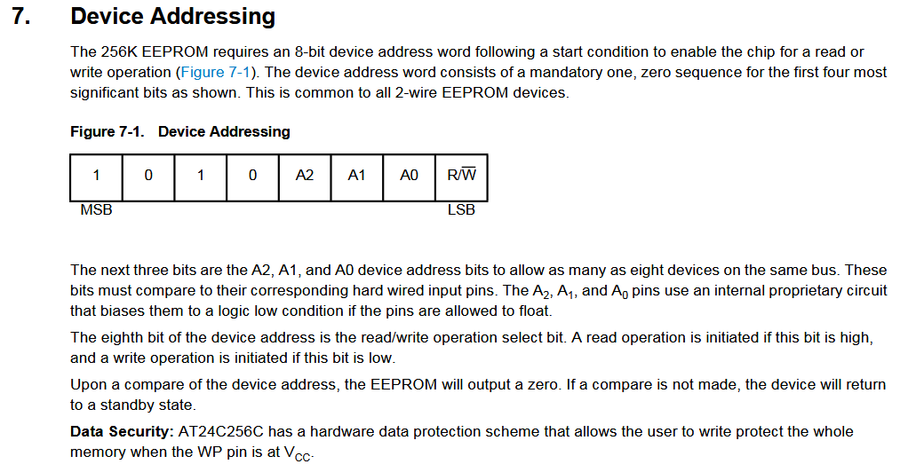

## 写
###### 前言
**写字节地址不会自增也不会回卷，Page Write 地址自增且回卷**
EEPROM 上电或未写入的字节默认是 `0xFF`（255）
###### 字节 
AT24C256 是 32KB（地址 0x0000 ~ 0x7FFF），所以地址是 **16 位**，需要发送两个字节

流程示意
```cpp
START
↓
发送 8-bit 设备地址（写，例如 0xA0）
↓
EEPROM 回 ACK（0）
↓
发送地址高字节（AH）
↓
EEPROM ACK
↓
发送地址低字节（AL）
↓
EEPROM ACK
↓
发送一个数据字节（D0）
↓
EEPROM ACK   // 注意这一步不可以少
↓
STOP（结束写序列）
↓
EEPROM 内部进行写周期 tWR (5ms 左右)

```

- 芯片内部擦写 Flash 单元
- 整个芯片“关闭输入”，不会响应新的指令


###### 页
EEPROM 的存储空间按“页”划分，**每页 64 字节**（因为低 6 位地址正好 0-63）。
Page Write 与 Byte Write 区别只有一点：
**写完第一个数据后不发送 STOP，而是继续发送更多数据（最多 64 个）。**

示意
```cpp
START
设备地址(A0) → ACK
地址高字节 → ACK
地址低字节 → ACK

数据1 → ACK
数据2 → ACK
…
数据64 → ACK

STOP 结束写序列
EEPROM 内部写64字节
```

###### **地址自动递增（Auto-increment）+ 页回卷（roll-over）**
因为低 6 位可以表示 0~63 → 对应 64 字节，高地址字节保持不变，所以不会跨页。
```cpp
Address = HHHHHHHH LLLLLLxx
                       ↑↑↑↑↑↑
                     自动递增的部分（0~63）
```
如果从一个页的末尾地址开始写，例如：
地址 0x003F  (页的最后一个字节)
所有连续超过 64 字节的写入，会**覆盖本页的前面的数据**。


###### ACK 轮询
**写入期间（5ms 内）**：
- EEPROM 不接受任何命令
- 不会 ACK 器件地址
写字节和写页均需要 5ms 时间，所以写完之后需要：
```c
for (i = 0; i < buffLen; i++)
{
    AT24C256_WriteByte(i, (uint8_t)i);
    Delay_ms(6); // 等待写入完成，5ms
}
```
循环发送器件地址（写模式）
- 如果 EEPROM 还在写，它不会 ACK（即 SDA=1）。  
- 当写完后，它会 ACK（拉低 SDA）。

###### 注意
- **不要在 page write 中发送超过 64 字节**，因为会覆盖本页。
- **写操作后执行 ACK-polling**：写操作触发设备内部写周期（tWR），==在此期间设备不会 ACK==。通过轮询设备地址直到 ACK 即可检测写完成，避免盲等固定延时。
- **Read 操作的 auto-increment**：读（sequential read）也会在地址自动递增，且读取到**地址末（不是页末）** 会继续回卷到**芯片首地址（不是页）**（same page wrap）——注意读也遵循相同的低 6 位回卷规则（不过常见用法是跨页读时先设置地址然后连续读多个字节，芯片会按同样的低位回卷行为返回数据）。

## 读

I²C EEPROM（ AT24C256 系列）共有三种读操作：

1. **Current Address Read（当前地址读）**
    
2. **Random Read（随机地址读）** —— 实际上由 Dummy Write + Current Read 构成
    
3. **Sequential Read（顺序读）**
    

核心机制是：
- 读出数据后，只要 MCU 继续发 ACK，EEPROM 就 **自动递增地址**（Auto-Increment）继续输出下一字节。
- 若地址达到最大（如 0x7FFF），则 **回卷到 0x0000**（Roll-Over）。
- **当且仅当达到址达最大值才会回卷** ，页末是不会回卷的。
- **所有读操作（Current / Random / Sequential Read）在地址溢出时，回卷（roll-over）的目标都是整个 EEPROM 的最起始地址（0x0000）**。


###### Current Address Read（当前地址读）
EEPROM 内部维护一个 **地址计数器（address pointer）**。
- 是上一次操作所使用的地址 **+ 1**
- 如果电源保持不断电，此地址一直有效。

时序过程
1. MCU 发 START
2. MCU 发 **设备地址 + R（读）**
3. EEPROM ACK
4. EEPROM 输出计数器当前指向的地址内的数据
5. MCU 发 NACK + STOP（表示不再读更多）

自动递增 + 回卷
- 读完 1 字节后，EEPROM 自动执行：`address++`
- 若到**最后地址**（如 0x7FFF）：
    - 再++ → 回卷为 **0x0000**

###### Random Read（随机地址读）
“先写地址，但不写数据，再读”

时序步骤
1. MCU 发 START
2. MCU 发设备地址 + **W（写）**
3. EEPROM ACK
4. MCU 发送 **地址高字节**
5. EEPROM ACK
6. MCU 发送 **地址低字节**
7. EEPROM ACK  
    （这里就是所谓的 “dummy write”，只是写地址，不写数据）
8. MCU 发 **重复起始（Repeated START）**
9. MCU 发设备地址 + **R（读）**
10. EEPROM ACK
11. EEPROM 输出 “刚才指定的地址” 的数据
12. MCU NACK + STOP 结束

自动递增
- EEPROM 输出 1 字节后会将内部地址执行：`address++`
- 如果继续发 ACK，而不是 NACK，那么就进入顺序读（Sequential Read）。

###### Sequential Read（顺序读）
顺序读等于： Current Address Read / Random Read 的拓展版

只要 MCU 对每个字节发送 **ACK（0）**，EEPROM 就继续：
- 输出下一字节 → 地址自动递增

时序
- MCU 收到 EEPROM 发的 1 字节数据
- MCU 发 ACK
- EEPROM 自动递增地址计数器 → 输出下一字节
- MCU 再 ACK
- 无限循环直到 MCU 发 NACK + STOP

地址回卷（roll-over）
1. 当 EEPROM **地址达到最大值**，例如 24LC256（32KB）→ 最后地址 0x7FFF
2. 当继续 auto-increment：`0x7FFF + 1 → 0x0000`
3. 顺序读会从 EEPROM 开头继续读（循环读整个芯片）。
> 注意：  
> 回卷不是进入下一页，而是直接回到 **整个芯片的开始**，回卷只会发生在读到**地址达到最大值**。

###### 总结

| 类型                   | 是否需要 dummy write? | 地址自动递增  | 回卷方式  | 使用场景       |
| -------------------- | ----------------- | ------- | ----- | ---------- |
| Current Address Read | ❌                 | ✔       | 芯片级回卷 | 连续读取，不指定地址 |
| Random Read          | ✔（只写地址）           | ✔       | 芯片级回卷 | 从任意地址读取    |
| Sequential Read      | ✔（隐式/显式）          | ✔✔✔持续递增 | 芯片级回卷 | 连续大量读取     |


## OTA 代码
```cpp
#ifndef __AT24C256_H__
#define __AT24C256_H__

#include "UserIIC.h"
#include "stm32f10x.h"

// 器件地址为 1010  A2 A1 A0 X
/// A2 A1 A0 接GND 时，器件地址为 1010 000X
#define AT24C256_ADDR_WRITE   0xA0 // 写地址
#define AT24C256_ADDR_READ    0xA1 // 读地址
#define AT24C256_PAGE_SIZE 64  // 每页64字节
#define AT24C_ADDR_LEN 2 // 地址字节数
#define ERR_OK 0
#define ERR_NAK -1
#define ERR_TIMEOUT -2
#define ERR_BUSY -3
#define ERR_ADD_NAK -4
#define ERR_MEM_NAK -5

int8_t AT24C256_WriteByte(uint16_t memAddr, uint8_t byte);
int8_t AT24C256_WritePage(uint16_t memAddr, uint8_t *bytes, uint8_t writeLen);
int8_t AT24C256_ReadBytes(uint16_t memAddr, uint8_t *bytes, uint8_t readLen);

#endif /* __AT24C256_H__ */


```

```cpp
#include "stm32f10x.h"
#include "AT24C256.h"
#include "UserIIC.h"

int AT24C_SendAddr(uint16_t memAddr)
{
    if (AT24C_ADDR_LEN == 2)
    {
        IICSendByte(memAddr >> 8);
        if (!IICWaitACk())
        {
            IICStop();
            return ERR_MEM_NAK;
        }
    }
    IICSendByte(memAddr & 0xFF);
    if (!IICWaitACk())
    {
        IICStop();
        return ERR_MEM_NAK;
    }
    return ERR_OK;
}


int8_t AT24C256_WriteByte(uint16_t memAddr, uint8_t byte)
{
    IICStart();
    IICSendByte(AT24C256_ADDR_WRITE);
    if (!IICWaitACk())
    {
        IICStop();
        return ERR_ADD_NAK;
    }
    if (AT24C_SendAddr(memAddr) != ERR_OK)
    {
        IICStop();
        return ERR_MEM_NAK;
    }
    IICSendByte(byte);
    if (!IICWaitACk())
    {
        IICStop();
        return ERR_NAK;
    }
    IICStop();
    return 0;
}

int8_t AT24C256_WritePage(uint16_t memAddr, uint8_t *bytes, uint8_t writeLen)
{
    IICStart();
    IICSendByte(AT24C256_ADDR_WRITE);
    if (!IICWaitACk())
    {
        IICStop();
        return ERR_ADD_NAK;
    }
    if (AT24C_SendAddr(memAddr) != ERR_OK)
    {
        IICStop();
        return ERR_MEM_NAK;
    }
    for (uint8_t i = 0; i < writeLen; i++)
    {
        IICSendByte(bytes[i]);
        if (!IICWaitACk())
        {
            IICStop();
            return ERR_NAK; 
        }
    }
    IICStop();
    return 0;
}

int8_t AT24C256_ReadBytes(uint16_t memAddr, uint8_t *bytes, uint8_t readLen)
{
    IICStart();
    IICSendByte(AT24C256_ADDR_WRITE);
    if (!IICWaitACk())
    {
        IICStop();
        return ERR_ADD_NAK;
    }
    if (AT24C_SendAddr(memAddr) != ERR_OK)
    {
        IICStop();
        return ERR_MEM_NAK;
    }

    IICStart(); // 完成dummy write, 然后再次发送起始信号
    IICSendByte(AT24C256_ADDR_READ);
    if (!IICWaitACk())
    {
        IICStop();
        return ERR_ADD_NAK;
    }
    for (uint8_t i = 0; i < readLen; i++)
    {
        bytes[i] = IICReceiveByte(i == readLen - 1 ? 1 : 0); // NAK on last byte
    }
    IICStop();
    return 0;
}


```

# SPI（和W25Q64）
## SPI

### 引脚映像
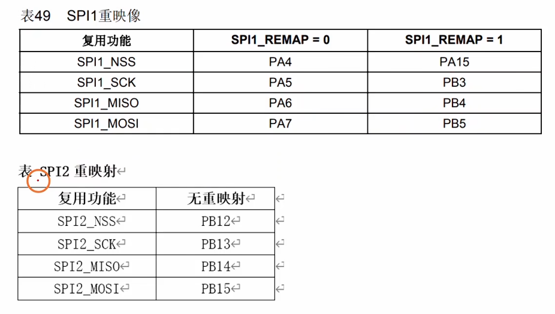

```c
// SPI_SCK_Pin | SPI_MOSI_Pin 用 GPIO_Mode_AF_PP
GPIO_InitStruct.GPIO_Mode = GPIO_Mode_AF_PP;
GPIO_InitStruct.GPIO_Pin = SPI_SCK_Pin | SPI_MOSI_Pin;

// SPI_MISO_Pin 用 GPIO_Mode_IPU
GPIO_InitStruct.GPIO_Mode = GPIO_Mode_IPU;
GPIO_InitStruct.GPIO_Pin = SPI_MISO_Pin;
```

### 极性和相位
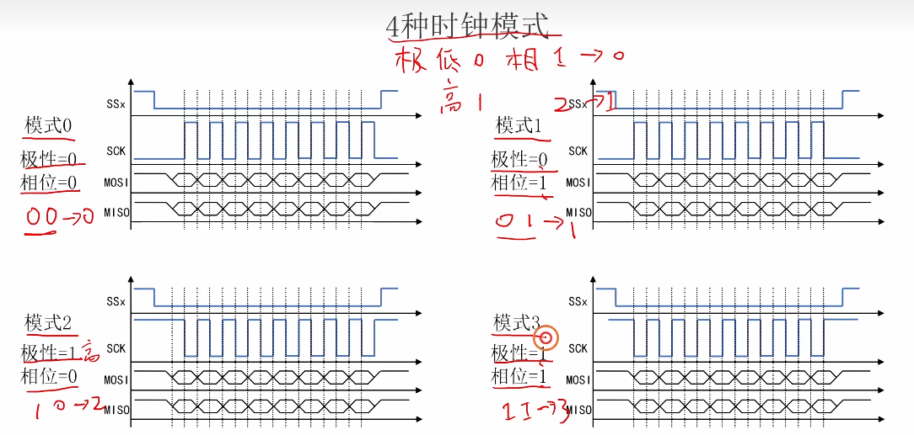
- **`Mode0：CPOL=0，CPHA=0`**：此时空闲态时，SCLK处于低电平，数据采样是在第1个边沿，也就是SCLK由低电平到高电平的跳变，所以数据采样是在上升沿(准备数据），（发送数据）数据发送是在下降沿。

- **`Mode1：CPOL=0，CPHA=1`**：此时空闲态时，SCLK处于低电平，数据发送是在第1个边沿，也就是SCLK由低电平到高电平的跳变，所以数据采样是在下降沿，数据发送是在上升沿。
    
- **`Mode2：CPOL=1，CPHA=0`**：此时空闲态时，SCLK处于高电平，数据采集是在第1个边沿，也就是SCLK由高电平到低电平的跳变，所以数据采集是在下降沿，数据发送是在上升沿。
    
- **`Mode3：CPOL=1，CPHA=1`**：此时空闲态时，SCLK处于高电平，数据发送是在第1个边沿，也就是SCLK由高电平到低电平的跳变，所以数据采集是在上升沿，数据发送是在下降沿。

### 初始化参数
```c
typedef struct
{
uint16_t SPI_Direction; /*!< 传输方向，两向全双工，单向接收等*/
uint16_t SPI_Mode; /*!< 模式选择，确定主机还是从机 */
uint16_t SPI_DataSize; /*!< 数据大小，8位还是16位 */
uint16_t SPI_CPOL; /*!< 时钟极性选择 */
uint16_t SPI_CPHA; /*!< 时钟相位选择 */
uint16_t SPI_NSS; /*!< 片选是硬件还是软件*/
uint16_t SPI_BaudRatePrescaler; /*!< 分频系数 */
uint16_t SPI_FirstBit; /*!< 指定数据传输是从MSB还是LSB位开始的。M
SB就是二进制第一位，LSB就是最后一位 */
uint16_t SPI_CRCPolynomial; /*!< CRC校验 ，设置 CRC 校验多项式，提高通
信可靠性，大于 1 即可*/
}SPI_InitTypeDef;


SPI_InitTypeDef SPI_InitStruct = {0};
// SPI_Direction参数：
// SPI_Direction_2Lines_FullDuplex：全双工模式，同时发送和接收数据
// SPI_Direction_2Lines_RxOnly：全双工模式，只接收数据
// SPI_Direction_1Line_RxOnly：单工模式，只接收数据
// SPI_Direction_1Line_TxOnly：单工模式，只发送数据
SPI_InitStruct.SPI_Direction = SPI_Direction_2Lines_FullDuplex;
// SPI_Mode参数：
// SPI_Mode_Master：主模式
// SPI_Mode_Slave：从模式
SPI_InitStruct.SPI_Mode = SPI_Mode_Master;
// SPI_DataSize参数：
// SPI_DataSize_8b：8位数据大小
// SPI_DataSize_16b：16位数据大小
SPI_InitStruct.SPI_DataSize = SPI_DataSize_8b;
// SPI_CPOL参数：
// SPI_CPOL_Low：时钟极性为低电平
// SPI_CPOL_High：时钟极性为高电平
SPI_InitStruct.SPI_CPOL = SPI_CPOL_Low;
// SPI_CPHA参数：
// SPI_CPHA_1Edge：时钟相位为第1个时钟沿
// SPI_CPHA_2Edge：时钟相位为第2个时钟沿
SPI_InitStruct.SPI_CPHA = SPI_CPHA_1Edge;
// SPI_NSS参数：
// SPI_NSS_Soft：软件NSS管理
// SPI_NSS_Hard：硬件NSS管理
SPI_InitStruct.SPI_NSS = SPI_NSS_Soft;
// SPI_BaudRatePrescaler参数：
// SPI_BaudRatePrescaler_2：波特率预分频器为2
// SPI_BaudRatePrescaler_4：波特率预分频器为4
// SPI_BaudRatePrescaler_8：波特率预分频器为8
// SPI_BaudRatePrescaler_16：波特率预分频器为16
// SPI_BaudRatePrescaler_32：波特率预分频器为32
// SPI_BaudRatePrescaler_64：波特率预分频器为64
// SPI_BaudRatePrescaler_128：波特率预分频器为128
// SPI_BaudRatePrescaler_256：波特率预分频器为256
SPI_InitStruct.SPI_BaudRatePrescaler = SPI_BaudRatePrescaler_2;
// SPI_FirstBit参数：
// SPI_FirstBit_MSB：先发送或接收MSB位
// SPI_FirstBit_LSB：先发送或接收LSB位
SPI_InitStruct.SPI_FirstBit = SPI_FirstBit_MSB;
// SPI_CRCPolynomial参数：
// 7：CRC多项式为7
// 10：CRC多项式为10
SPI_InitStruct.SPI_CRCPolynomial = 7;
SPI_Init(SPIx, &SPI_InitStruct);
SPI_Cmd(SPIx, ENABLE);
```

### 发送和接收(收发一体，发必须收，收必须发，如果没有发送数据通常 0xFF)
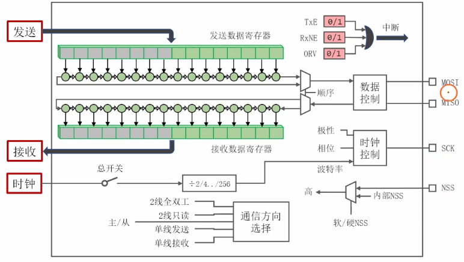

### 标志位
#### 函数原型
```c
FlagStatus SPI_I2S_GetFlagStatus(SPI_TypeDef* SPIx, uint16_t SPI_I2S_FLAG);
```
- **作用**：读取 SPI 或 I2S 外设的状态标志（Flag）。
- **参数**：
    - `SPIx`：指定 SPI 外设，如 `SPI1`、`SPI2`。
    - `SPI_I2S_FLAG`：要查询的标志，如 `SPI_I2S_FLAG_TXE`（发送缓冲区空）、`SPI_I2S_FLAG_RXNE`（接收缓冲区非空）等。
- **返回值**：
    - `SET`（1）：标志位置位（true）
    - `RESET`（0）：标志位清零（false）

####  TXE（Transmit Buffer Empty）标志
- 宏定义：`SPI_I2S_FLAG_TXE`
- 位置：位于 SPI_SR 寄存器（状态寄存器）的第 1 位（通常叫 TXE）。
含义：

| TXE 值   | 意义                                |
| ------- | --------------------------------- |
| `SET`   | 发送缓冲区空，SPI 可以写入新的数据到 DR 寄存器，开始发送。 |
| `RESET` | 发送缓冲区未空，DR 中的数据仍在等待发送，暂不能写入新数据。   |

#### 其他标志位

|标志位宏|所在寄存器|含义|状态说明|
|---|---|---|---|
|**TXE** (`SPI_I2S_FLAG_TXE`)|SPI_SR|Transmit buffer empty|`SET` 表示 DR 寄存器空，可写数据；`RESET` 表示 DR 寄存器未空，不能写新数据|
|**RXNE** (`SPI_I2S_FLAG_RXNE`)|SPI_SR|Receive buffer not empty|`SET` 表示接收缓冲区有数据可读；`RESET` 表示无新数据|
|**BSY** (`SPI_I2S_FLAG_BSY`)|SPI_SR|Busy flag|`SET` 表示 SPI 正在传输数据（DR -> 移位寄存器发送中），不能改变某些控制位；`RESET` 表示空闲|
|**OVR** (`SPI_I2S_FLAG_OVR`)|SPI_SR|Overrun flag|`SET` 表示接收缓冲区溢出（RX 数据被覆盖）|
|**MODF** (`SPI_I2S_FLAG_MODF`)|SPI_SR|Mode fault|`SET` 表示主模式选择错误（通常主从冲突）|
|**CRCERR** (`SPI_I2S_FLAG_CRCERR`)|SPI_SR|CRC error|`SET` 表示 CRC 校验错误（仅在 CRC 使能时有效）|
|**UDR** (`SPI_I2S_FLAG_UDR`)|SPI_SR|Underrun error|`SET` 表示在 I2S 模式下发送缓冲区下溢|
|**CHSIDE** (`SPI_I2S_FLAG_CHSIDE`)|SPI_SR|Channel side|`SET` 表示 I2S 接收到右声道数据（仅 I2S 模式有效）|
|**TXE/ RXNE (I2S)**|SPI_SR|同 SPI 模式|I2S 模式下仍然使用 TXE / RXNE 控制数据发送/接收|


## W25Q64
### 接线
**注意 DO 接 MISO(SPI 对应 PA6(不重映射))**
**注意 DI 接 MOSI(SPI 对应 PA7(不重映射))**
**注意 CLK 接 SCK(SPI 对应 PA5(不重映射))**
**==正负极需要连接==正确 W25Q64 指示红灯应该亮起**
### 模式 ( 0 或 3 都可以)
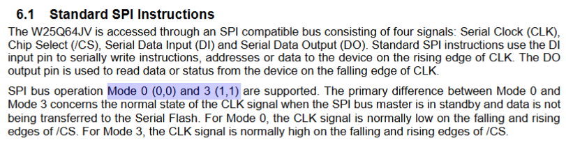
### 速度
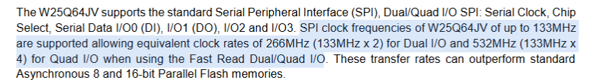
### 比特顺序
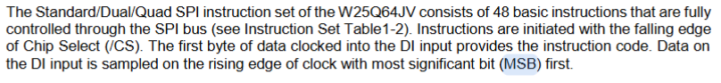
- **数据按 MSB（最高位）先传输**
- 比如 0xA5 = `1010 0101`
    - 发送顺序：`1 → 0 → 1 → 0 → 0 → 1 → 0 → 1`
### 指令集、状态寄存器
#### 指令集
[[W25Q64_英文规格书_NOR+FLASH.PDF#page=23&selection=7,0,9,1|指令集]]
##### Instruction Set Table 1
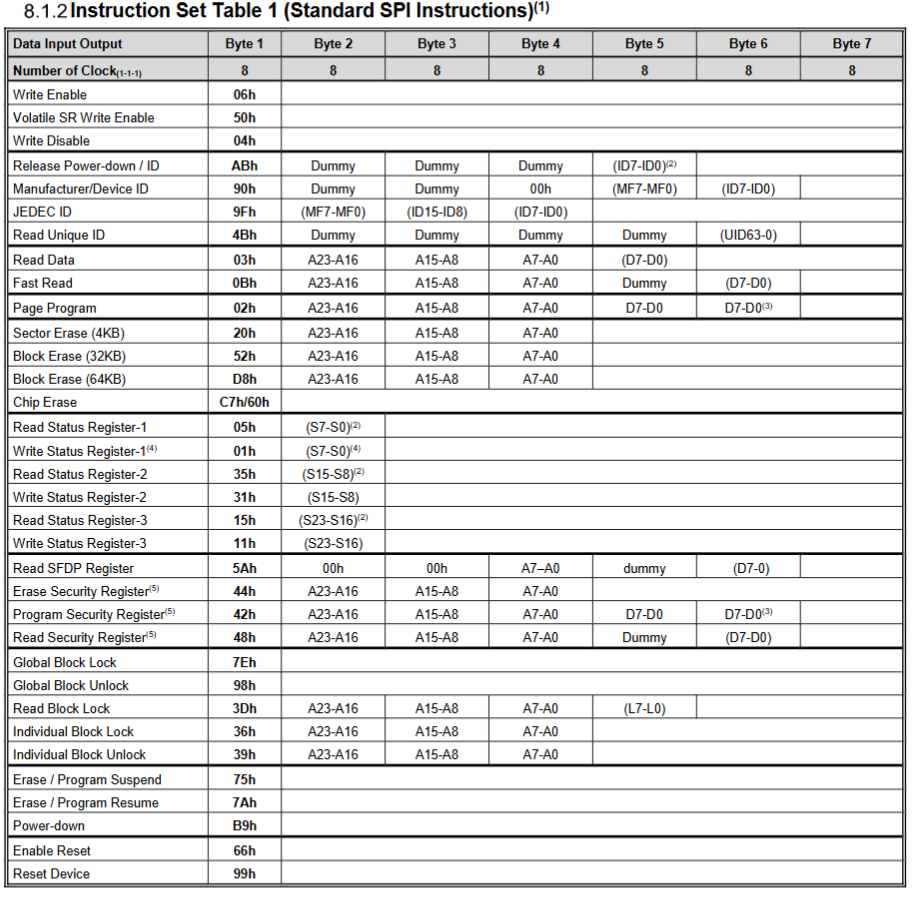

##### Instruction Set Table 2 
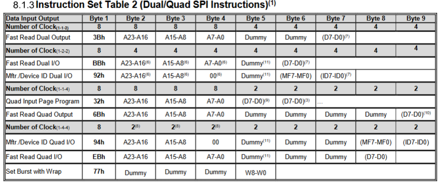

##### 示例 （用于测试 USART 是否正常）
`0x9F` 是 **读取 JEDEC ID** 命令，正确情况下，返回 **3 字节**：
1. **厂商 ID (Manufacturer ID)**
    - W25Q64 是 Winbond 的芯片，通常是 `0xEF`
2. **存储器类型 (Memory Type)**
    - W25Q64 通常是 `0x40`
3. **容量 (Capacity)**
    - 64 Mbit = 8 MB，返回 `0x17`
```c
uint8_t id[3];
SPIWBytes((uint8_t[]){0x9F}, 1);
SPIRBytes(id, 3);
CS_DISABLE;
printf("W25Q64 ID: %02X %02X %02X\n", id[0], id[1], id[2]);

W25Q64 ID: EF 40 17
```

| 字节                | 内容              | 描述                        |
| ----------------- | --------------- | ------------------------- |
| 第 1 字节 (MF7-MF0)  | Manufacturer ID | 厂商 ID，例如 Winbond = `0xEF` |
| 第 2 字节 (ID15-ID8) | Memory Type     | 存储器类型，例如 W25Q64 = `0x40`  |
| 第 3 字节 (ID7-ID0)  | Capacity        | 容量，例如 64 Mbit = `0x17`    |
##### 总结

| **项**        | **核心要点**      |
| ------------ | ------------- |
| 位顺序          | MSB first     |
| Page Program | ≤ 256B，不然地址回卷 |
| 状态寄存器        | CS 拉低会一直输出    |
| Dual SPI     | 奇偶位分到 IO0/IO1 |
| Quad SPI     | 地址 & 数据 4 线并行 |
| Dummy Cycle  | **填 0xFF**    |
| Security Reg | 用地址区分         |

#### 说明
W25Q 有 3 个 8-bit 状态寄存器（SR1 / SR2 / SR3），每个都有“读指令”和“写指令”，指令码不同、位意义不同。
- 05h / 35h / 15h：读 SR1 / SR2 / SR3  
- 01h / 31h / 11h：写 SR1 / SR2 / SR3  
- SR1 管忙闲，SR2 管 Quad，SR3 管高级特性

W25Q 的状态寄存器一共 **24 位**：
```c
SR3   SR2   SR1
┌────┬────┬────┐
|S23 |S15 |S7  |  ← MSB
| ~  | ~  | ~  |
|S16 |S8  |S0  |  ← LSB
└────┴────┴────┘
```

| 寄存器                   | 位号      |
| --------------------- | ------- |
| **Status Register-1** | S7–S0   |
| **Status Register-2** | S15–S8  |
| **Status Register-3** | S23–S16 |
每个寄存器 **8 bit，独立读写**

| 操作                      | 指令      | 说明              |
| ----------------------- | ------- | --------------- |
| Read Status Register-1  | **05h** | 读 SR1 (S7–S0)   |
| Write Status Register-1 | **01h** | 写 SR1 (S7–S0)   |
| Read Status Register-2  | **35h** | 读 SR2 (S15–S8)  |
| Write Status Register-2 | **31h** | 写 SR2 (S15–S8)  |
| Read Status Register-3  | **15h** | 读 SR3 (S23–S16) |
| Write Status Register-3 | **11h** | 写 SR3 (S23–S16) |
#### 位说明

SR1（05h / 01h）——**最基础、最常用**
比如读取 SR1（发送）05h，得到的 byte，第一位（&0x01）如果是 1 则表明正在写或者擦除

|Bit|名称|含义|
|---|---|---|
|S0|WIP|写/擦进行中|
|S1|WEL|写使能锁存|
|S2–S4|BP|块保护|
|S5|TB|保护区方向|
|S6|SEC|扇区 / 块|
|S7|SRP0|状态寄存器保护|

SR2（35h / 31h）——**工作模式配置**

|Bit|名称|作用|
|---|---|---|
|S8|SRP1|状态寄存器保护|
|S9|QE|Quad Enable|
|S10–S14|保留 / 配置||
|S15|SUS|Program/Erase Suspend|


SR3（15h / 11h）——**高级控制**

|Bit|名称|说明|
|---|---|---|
|S16|HOLD/RST|HOLD 或 RESET 功能选择|
|S17|DRV|驱动能力|
|S18|LB|安全寄存器锁|
|S19–S23|Vendor 特定|

### 擦除、读和写
#### 擦除（64KB）
64KB 块擦除指令（擦除后的数值为 0xFF）

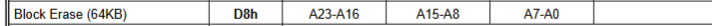
64k 擦除指令需要发送 4 个字节，第一个字节是指令，后三个字节是地址（0 到 23 位）
地址总共 24 位（3 字节）

**一个 block 64KB = 64\*1024 = 65536 字节，一个页 256 字节，65536/256=256 页，因此一个 block 有 256 个页。**(B：字节， b：位)

| 字段      | 位宽    | 说明         |
| ------- | ----- | ---------- |
| D8h     | 8 bit | 64KB 块擦除命令 |
| A23–A16 | 8 bit | 地址高字节      |
| A15–A8  | 8 bit | 地址中字节      |
| A7–A0   | 8 bit | 地址低字节      |
标准时序流程
```c
1. **Write Enable（06h）**
    
2. **CS ↓**
    
3. 发送 `D8h`
    
4. 发送地址 3 字节（A23 A15 A7）
    
5. **CS ↑**
    
6. 内部开始擦除（几十到几百 ms）
    
7. **轮询 WIP 位（BUSY）**
```

##### 注意

| 读到的值 | 二进制         | 含义                 |
| ---- | ----------- | ------------------ |
| 255  | `1111 1111` | **完全没写成功（擦除态）**    |
| 254  | `1111 1110` | **只写下了 bit0**      |
| 252  | `1111 1100` | **只写下了 bit0、bit1** |
W25Q64 的“铁律”（Flash 写入铁律）
> **Flash 只能把 bit 从 1 写成 0**  
> **如果想从 0 变回 1，必须先擦除（Erase）**

|操作|结果|
|---|---|
|写 1 → 1|✅|
|写 1 → 0|✅|
|写 0 → 1|❌（不可能）|
|擦除|全部变成 1（0xFF）|


#### 写

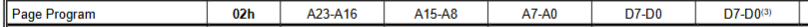
`02h` 是 Page Program 指令  
用于 向同一个 256-byte 页内连续写入 1～256 个字节。

|字段|位宽|含义|
|---|---|---|
|02h|8 bit|Page Program 指令|
|A23–A16|8 bit|地址高字节|
|A15–A8|8 bit|地址中字节|
|A7–A0|8 bit|地址低字节（页内偏移）|
|D7–D0|8 bit|第 1 个写入的数据|
|D7–D0 (3)|8 bit|后续数据（最多 256 个）|

> `(3)` 表示：**可以重复发送数据字节**

Page（**写入不能跨页**）
- **一页 = 256 Bytes**
- 页地址结构：
	```c
	A23 ........ A8 | A7 ........ A0    页号           页内偏移
	```

地址回卷
如果写入的数据 **超过当前页剩余空间**：
- **地址在页内回卷**  
- **不会写到下一页**

标准时序流程
```c
1. **Write Enable（06h）**
    
2. CS ↓
    
3. 发送 `02h`
    
4. 发送 3 字节地址
    
5. 连续发送 1～256 字节数据
    
6. CS ↑
    
7. Flash 内部编程（tPP）
    
8. 轮询 **WIP（BUSY）**
```

#### 读


|字段|位宽|含义|
|---|---|---|
|03h|8 bit|Read Data 指令|
|A23–A16|8 bit|地址高字节|
|A15–A8|8 bit|地址中字节|
|A7–A0|8 bit|地址低字节|
|(D7–D0)|8 bit|Flash 输出的数据|
|(…)|8 bit|后续数据，连续输出|
括号 `( )` 表示这是从设备输出的数据

标准时序流程
```c
1. **CS ↓**
    
2. 发送 `03h`
    
3. 发送 3 字节地址
    
4. Flash 立刻输出数据
    
5. 主机持续提供 SCK
    
6. Flash 持续递增地址并输出数据
    
7. **CS ↑** 结束
```

> **不需要 Dummy Cycle**

地址递增机制
 - **不会页回卷**  
 - **跨页、跨 sector、跨 block 自动连续读取**

Page Program 的本质区别

|操作|是否跨页|是否回卷|
|---|---|---|
|Page Program (02h)|❌ 不允许|✅ 会回卷|
|Read Data (03h)|✅ 允许|❌ 不回卷|


# FSMC （Flexible static memory controller，==本项目未使用==）

## 说明

FSMC 是 STM32 等 MCU 内部的一个硬件控制器模块，作用是：
> 让 MCU 像访问片内 RAM 一样去访问外部存储器或并行外设

它位于 AHB 总线和外部并行存储器接口之间。
- 1、**地址线**：是用来传输地址信息用的。举个简单的例子：cpu在内存或硬盘里面寻找一个数据时，先通过地址线找到地址，然后再通过数据线将数据取出来。如果有32根.就可以访问2的32次方的字节，也就是4GB。
- 2、**数据线**（data cable），来传递数据或通信。通俗点说，就是单片机发送指令给存储器，和存储器发送数据给单片机这两个功能

FSMC 包含四个主要模块： 
- AHB 接口(包含 FSMC 配置寄存器)
- NOR 闪存和 PSRAM 控制器 
- NAND 闪存和 PC 卡控制器 
- 外部设备接口

框图
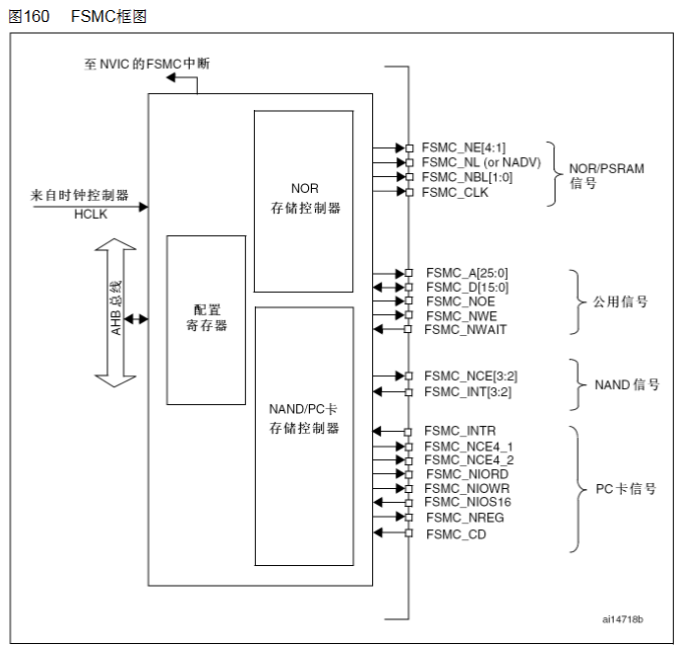


## 支持的存储器和操作
###  操作一致性
请求 AHB 操作的数据宽度可以是 8 位、16 位或 32 位，而外部设备则是固定的数据宽度，此时需要保障实现数据传输的一致性。
因此，FSMC 执行下述操作规则： 
 - AHB 操作的数据宽度与存储器数据宽度**相同**：无数据传输一致性的问题。 
 - AHB 操作的数据宽度**大于**存储器的数据宽度：此时 FSMC 将 AHB 操作**分割成几个连续的较小数据宽度的存储器操作**，以适应外部设备的数据宽度。
 - AHB 操作的数据宽度**小于**存储器的数据宽度： 依据外部设备的类型，异步的数据传输有可能不一致。 
	-  与具**有字节选择功能**的存储器(SRAM、ROM、PSRAM 等)进行异步传输时，FSMC 执行读写操作并通过它的字节通道 BL\[1:0]访问正确的数据。
	- 与**不具有字节选择功能**的存储器(NOR 和 16 位 NAND 等)进行异步传输时，即需要对 16 位宽的闪存存储器进行字节访问；显然不能对存储器进行字节模式访问(只允许 16 位的数据传输)，因此： 
		- a. 不允许进行写操作 
		- b. 可以进行读操作(控制器读出完整的 16 位存储器数据，只使用需要的字节)。

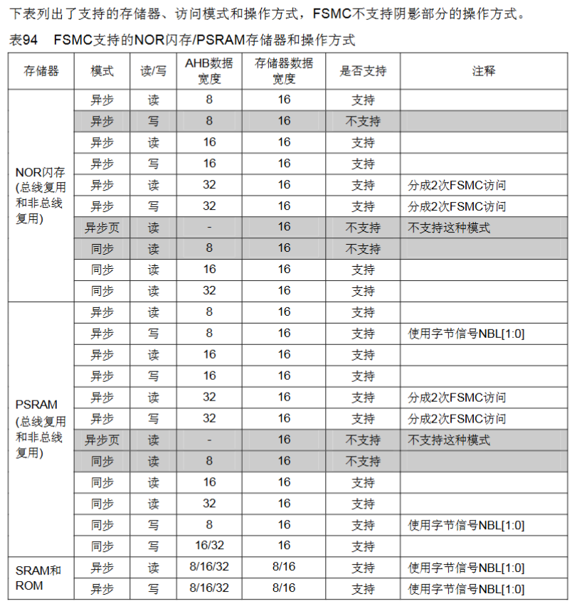

### 外部存储器接口信号
NOR/SRAM 信号 ：这部分是 NOR 和 SRAM 这类存储器的控制信号，其中：
- FSMC_CLK 是时钟信号
- FSMC_NE\[4:0]是片选信号选择 SRAM 的不同存储区域
- FSMC_NBL\[1:0] 是数据掩码
- FSMC_NL 是输入地址是否有效

具有前缀“N ”的信号表示低有效信号
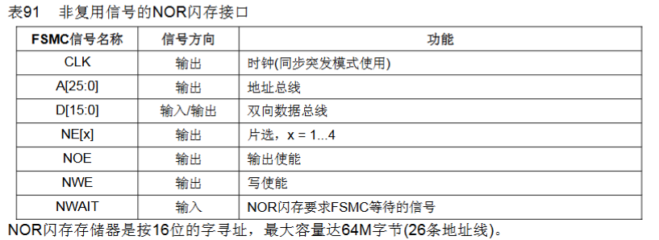

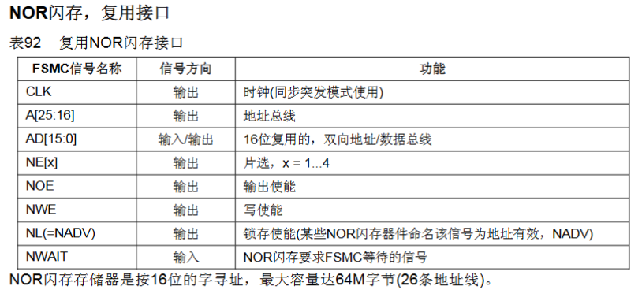
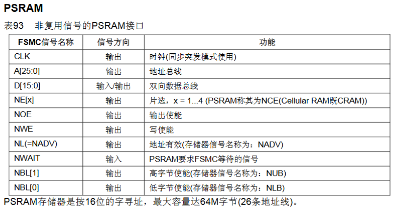


### 解释
（**FSMC 的任务**：在 AHB 访问宽度 ≠ 存储器物理宽度时，确保数据不乱、不丢、不写错。）
- AHB 总线：  
    CPU 发起的访问，数据宽度可以是 8 / 16 / 32 位
- 外部存储器（通过 FSMC）：
    - 数据宽度是固定的（8 位或 16 位）
    - 不随 CPU 的访问宽度变化

1. 情况 1：AHB 数据宽度 **=** 存储器数据宽度：
	- 1 次 AHB 访问  → 1 次存储器访问
2. 情况 2：AHB 数据宽度 **>** 存储器数据宽度 （FSMC 自动拆分）
	- 示例
		- AHB：32 位访问，外部存储器：16 位 SRAM / NOR
		- FSMC 会把一次大的访问 **拆成多次小访问**
			```c
			CPU： 1 次 32-bit 写
			FSMC：2 次连续的 16-bit 写
			```
3. 情况 3：AHB 数据宽度 **<** 存储器数据宽度 （最复杂）
	1. 子情况 3.1：存储器 **支持字节选择（Byte Lane）**
		- 支持的存储器类型 （特点：有 **BL[1:0] / NBL0 / NBL1** 信号）
			-  SRAM
			-  ROM
			-  PSRAM  
		- 示例
			- 外部存储器：16 位，AHB：8 位访问
			- FSMC 的处理方式
				- FSMC 仍然做 **16 位访问**
				- 但通过 **字节通道 BL[1:0]** 指定：访问高字节还是低字节
	2. 子情况 3.2：存储器 **不支持字节选择**
		- 不支持字节选择的典型器件
			-  NOR Flash			    
			- 16 位 NAND Flash
		- 重要特性
			- **只能 16 位整字访问**    
			- 没有 BL[1:0]    
			- 不能只访问其中 8 位
		- AHB 8 位 → NOR / 16 位 NAND：**写操作**
			-  CPU 想写 **1 个字节**，存储器 **必须写 16 位**    
			- FSMC：    
			    - 不知道你是想改高 8 位还是低 8 位        
			    - 另一半数据会被破坏
			- 不允许进行写操作
		- AHB 8 位 → NOR / 16 位 NAND：**读操作**
			- FSMC 的做法：
				1. 读取 **完整的 16 位数据**    
				2. 根据 AHB 地址偏移：    
				    - 只返回高 8 位 **或** 只返回低 8 位     
			- 读是安全
				- 读不会修改存储器内容
				- 丢弃一半数据没风险

| AHB 宽度 vs 存储器宽度 | 存储器类型             | 读   | 写   | 说明        |
| --------------- | ----------------- | --- | --- | --------- |
| 相同              | 任意                | ✅   | ✅   | 最理想       |
| AHB > 存储器       | 任意                | ✅   | ✅   | FSMC 自动拆分 |
| AHB < 存储器       | 有字节选择（SRAM/PSRAM） | ✅   | ✅   | 用 BL[1:0] |
| AHB < 存储器       | 无字节选择（NOR / NAND） | ✅   | ❌   | 只能整字写     |

## 外部设备地址映像
### 映像
从 FSMC 的角度看，可以把外部存储器划分为固定大小为 256M 字节的四个存储块，见下图。 
- 存储块 1 用于访问最多 4 个 NOR 闪存或 PSRAM 存储设备。这个**存储区被划分为 4 个 NOR/PSRAM 区并有 4 个专用的片选**。 
- 存储块 2 和 3 用于访问 NAND 闪存设备，每个存储块连接一个 NAND 闪存。 
- 存储块 4 用于访问 PC 卡设备每一个存储块上的存储器类型是由用户在配置寄存器中定义的。
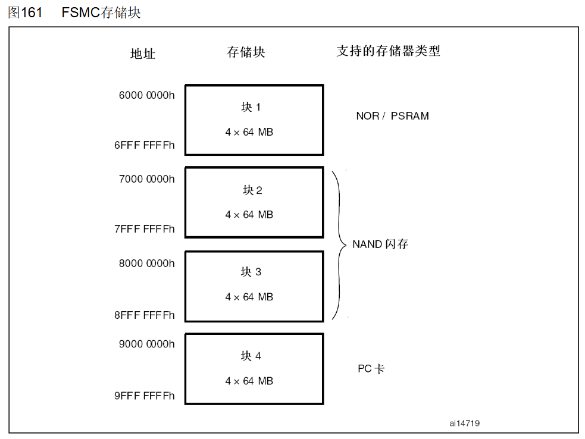

### 内核角度
内核只认识一件事：**地址空间**，在 Cortex-M3 看来，世界是一个 **线性 4GB 地址空间**，被划分成几大区域，例如：
1. Code（Flash）
2. SRAM
3. Peripheral（片上外设寄存器）
4. **External RAM**

内核并不关心，这块地址后面接的是 RAM，还是 FSMC，还是 LCD / NOR Flash，**它只做一件事：对某个地址读或写**。

- 在左侧存储空间分布中：`0x4000_0000 ~`：片上外设（Peripheral），`0x6000_0000 ~`：**External RAM 区域**，这个 **External RAM** 是一个“**预留窗口**”，意思是：这段地址空间可以**接外部扩展存储**器，但内核并不知道具体接了什么。

- 右侧：STM32 FSMC 的地址映射（外设视角），FSMC 作为一个 **AHB 从设备**，被映射到了 Cortex-M3 的： **External RAM 地址空间**，FSMC 内部再根据 **子地址** 做二次解码：

	|FSMC 外设|对应地址子空间|
	|---|---|
	|NOR / PSRAM / SRAM|FSMC Bank 1|
	|NAND Flash|FSMC Bank 2/3|
	|PC Card|FSMC Bank 4|
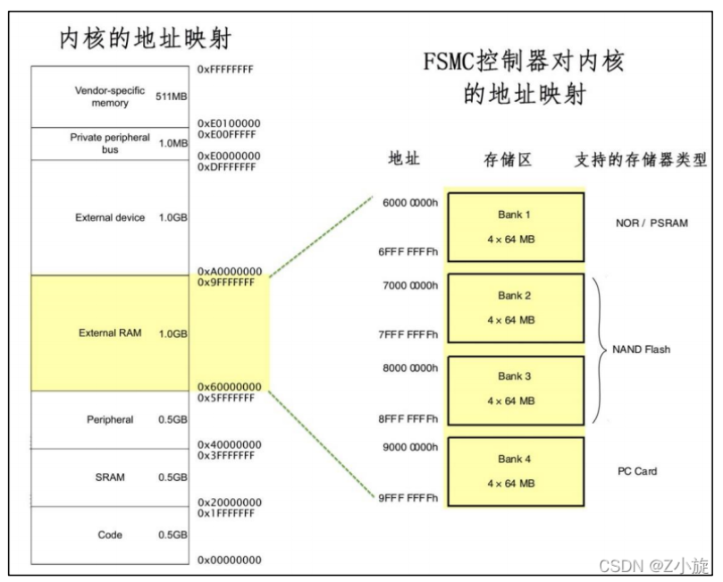

总结
因为 FSMC 把外部存储器映射进了 Cortex-M3 的统一地址空间，所以内核把它们当作“普通内存/外设”来访问，而所有复杂的总线与时序问题，都由 FSMC 在硬件中解决。
```c
CPU 访问 0x6xxx_xxxx
	  ↓
AHB 总线
	  ↓
FSMC
	  ↓
片选 + 时序 + 数据
	  ↓
外部存储器
```

### NOR / PSRAM 地址映像

#### 选存储块
高地址位用于“片选译码”，决定是哪一片外部存储器在响应，注意每个 block 里又分为 4 块（Bank） 64MB，HADDR[27:26]：选择 4 块 64MB 中的哪个 NOR / PSRAM 存储块。


##### HADDR 是什么？
- **HADDR** 是 Cortex-M3 通过 **AHB 总线** 发出的**内部地址**
- FSMC 会把 HADDR 转换成：
    - 片选信号（选哪个 Bank）
    - 外部地址线 FSMC_A[x:0]

##### HADDR[27:26] 的作用：选存储块（Bank）
FSMC 为 NOR / PSRAM 提供 **4 个独立存储块（Bank1~Bank4）**

|HADDR[27:26]|选择的存储块|
|---|---|
|00|NOR / PSRAM Bank1|
|01|NOR / PSRAM Bank2|
|10|NOR / PSRAM Bank3|
|11|NOR / PSRAM Bank4|

##### FSMC 真正看到的 HADDR 是什么？(重要)
CPU 发出的地址是 **完整 32 位地址**，但会被分成几级：
```c
CPU 地址
  ↓
系统总线矩阵（先判断属于哪个大区域）
  ↓
FSMC（只看到“External RAM 区域内的偏移地址”），External RAM 基地址 = 0x6000_0000
```

示例
**只要访问 0x6xxx_xxxx**，总线就会把请求交给 FSMC，FSMC 内部使用的是「**偏移地址**」
当 CPU 访问：（具体范围取决于芯片手册，但**高两位区分 Bank**这个原则不变）
```c
0x6000_0000 ~ 0x63FF_FFFF → HADDR = 0x6000_0000 - 0x6000_0000 = 0x0000_0000 → Bank1
0x6400_0000 ~ 0x67FF_FFFF → FSMC HADDR：0x0400_0000 → Bank2 （对应二进制0100000000000000000000000000）
0x6800_0000 ~ 0x6BFF_FFFF → Bank3
0x6C00_0000 ~ 0x6FFF_FFFF → Bank4
```

|CPU 访问地址|FSMC 内部 HADDR|HADDR[27:26]|Bank|
|---|---|---|---|
|0x6000_0000|0x0000_0000|00|Bank1|
|0x6400_0000|0x0400_0000|01|Bank2|
|0x6800_0000|0x0800_0000|10|Bank3|
|0x6C00_0000|0x0C00_0000|11|Bank4|

#### 送到存储器的“地址”
**Cortex-M3 的地址永远是「字节地址」**  ，不管访问的是 8/16/32 位，地址单位始终是 **1 字节**

|CPU 地址|含义|
|---|---|
|0x6000_0000|第 0 个字节|
|0x6000_0001|第 1 个字节|
|0x6000_0002|第 2 个字节|

HADDR[25:0]：真正送到存储器的“地址”，高位是 Bank 选。
- 表示 **存储块内部的地址偏移**
- 是 **字节地址（byte address）**
==但是，外部存储器并不一定按字节访问==

##### 外部地址线如何连接（8 位 vs 16 位）
###### 情况 1：8 位宽外部存储器
- 一个地址 = 一个字节
- CPU 的字节地址 **可以直接用**

| 项目     | 说明                         |
| ------ | -------------------------- |
| 数据宽度   | 8 bit                      |
| 地址线连接  | HADDR[25:0] → FSMC_A[25:0] |
| 最大地址空间 | 64 MB                      |

###### 情况 2：16 位宽外部存储器
16 位存储器的规则是，一个存储单元 = 16 bit = 2 字节，注意这里的“地址单位”已经是 **16 位字**，不是字节，CPU 地址是按 **字节** 编号的
		
|存储器地址|实际存的数据|
|---|---|
|A=0|字节 0 + 字节 1|
|A=1|字节 2 + 字节 3|
|A=2|字节 4 + 字节 5|

CPU 访问 0x6000_0000（16 位访问），CPU 的想法是：要访问从第 0 个字节开始的 16 位，FSMC 内部看到的地址偏移是：`HADDR = 0x0000_0000`
FSMC 发现：
- 存储器是 16 位
- 一个存储单元 = 2 字节
于是 FSMC **自动做这件事**（实际上就是把偏移地址除 2，因此右移一位）：
```c
存储器地址 = HADDR >> 1
          = 0x0000_0000 >> 1
          = 0
```
这就访问了 **第 0 个 16-bit 单元**

|项目|说明|
|---|---|
|数据宽度|16 bit|
|FSMC 内部使用|HADDR[25:1]|
|外部地址线|FSMC_A[24:0]|
|HADDR[0]|**不接**|
|最大地址空间|64 MB|

为什么 “HADDR[0] 不接”？
因为对于 **16 位存储器**：
- A[0] 的意义是： “这是第几个 16-bit 单元？”
- 而不是： “访问高字节还是低字节”
**高/低字节的选择**靠的是：
- NBL0 / NBL1（字节使能信号）
- 而不是地址线
所以：
- HADDR[0] **在地址换算阶段已经被用掉了**
- 不能、也没必要再接到外部地址线上

##### 总结
FSMC 用高地址选存储块、用低地址做地址换算；8 位器件直连，16 位器件右移一位；异步访问天然支持非对齐，而同步突发访问是否支持，取决于外部存储器本身的能力。

| 动作    | 外部存储器   | FSMC   | CPU            |
| ----- | ------- | ------ | -------------- |
| 16 位读 | 输出 16 位 | 原样转发   | 看到 16 位        |
| 8 位读  | 输出 16 位 | 截取 8 位 | 看到 8 位         |
| 16 位写 | 写 16 位  | NBL=00 | ✅              |
| 8 位写  | 写 8 位   | NBL 选择 | ✅（仅限支持字节选通的器件） |

###### 对于 16 位操作
读操作：谁决定“看到哪 8 位”？（NBL 不参与“读哪一半”的决定）
CPU 的地址是 **字节编号**，16 位存储器的一个单元覆盖 **两个连续字节**，所以：
- 偶数字节 = 低字节
- 奇数字节 = 高字节
```c
uint8_t v0 = *(uint8_t *)0x60000000;
uint8_t v1 = *(uint8_t *)0x60000001;

如果是 8-bit 读：
  如果 HADDR[0] = 0 → 取 DQ[7:0]  （低字节）
  如果 HADDR[0] = 1 → 取 DQ[15:8] （高字节）

```

写操作：谁决定“写哪 8 位”？

| CPU 地址 | HADDR[0] | 作用  | NBL0  | NBL1  |     |
| ------ | -------- | --- | ----- | ----- | --- |
| 偶数地址   | 0        | 低字节 | 0（有效） | 1（禁止） |     |
| 奇数地址   | 1        | 高字节 | 1（禁止） | 0（有效） |     |


## 代码示例

1. FSMC 初始化示例（寄存器方式）
	```c
	#include "stm32f10x.h"
	
	// 假设外部 SRAM 接到 FSMC Bank1
	#define SRAM_BASE_ADDR 0x60000000
	
	void FSMC_SRAM_Init(void) {
	    // 1. 使能 FSMC 和 GPIO 时钟
	    RCC->AHBENR |= RCC_AHBENR_FSMCEN;
	    RCC->APB2ENR |= RCC_APB2ENR_IOPCEN | RCC_APB2ENR_IOPDEN;
	
	    // 2. 配置 GPIO 为 FSMC 模式
	    // 这里略过具体管脚配置，需要根据硬件接法设置
	    // PD0-PD15 -> D0-D15
	    // PD0-PD3, PD4-PD7, etc.
	    // 使用复用功能 AFIO_FSMC
	
	    // 3. 配置 FSMC_BCR1 寄存器（Bank1）
	    FSMC_Bank1->BTCR[0] = 0x00001011; 
	    // BCR1:
	    // - Memory type: SRAM/ROM
	    // - Data bus width: 16-bit
	    // - Enable memory: MBKEN = 1
	
	    // 4. 配置 FSMC_BTR1 寄存器（时序）
	    FSMC_Bank1->BTCR[1] = 0x00000202; 
	    // BTR1:
	    // - Address setup time = 2 HCLK cycles
	    // - Data setup time = 2 HCLK cycles
	}
	
	```
	
2.  FSMC 读写操作示例
```c
#include <stdint.h>

#define SRAM ((volatile uint16_t*)SRAM_BASE_ADDR)
// SRAM 指向 SRAM_BASE_ADDR，`SRAM[0]` = 第 0 个 16 位单元，`SRAM[1]` = 第 1 个 16 位单元（地址偏移 +2 字节）
void SRAM_Write(uint32_t addr, uint16_t data) {
    SRAM[addr] = data;   // 直接写入
}

uint16_t SRAM_Read(uint32_t addr) {
    return SRAM[addr];   // 直接读取
}

```
3. 测试示例
	```c
	int main(void) {
	    uint16_t value;
	
	    FSMC_SRAM_Init(); // 初始化 FSMC
	
	    // 写数据
	    SRAM_Write(0, 0x1234);
	    SRAM_Write(1, 0xABCD);
	
	    // 读数据
	    value = SRAM_Read(0); // 0x1234
	    value = SRAM_Read(1); // 0xABCD
	
	    while(1);
	}
	```


# STM32片上 Flash
## 说明
STM32 的 FLASH 默认就是用来存放“程序文件（代码）”的，上电 / 复位后，CPU 从 FLASH 取指令执行，因此，示例时擦除后第 0 页（0x0800_0000-0x0800_0400）时，程序代码以及不存在了也不会继续执行。**而 OTA 需要做的就是擦除代码，然后写入到 FLASH 的指定地址（假设 0x08005000，让代码跳转到这个地址执行，如果需要升级代码也是将代码下载到 0x08005000）。**
注意：这是**内部 Flash**，**不是通过 FSMC 连接的外部存储器**。Flash 是 MCU 内部可擦写的非易失性存储器，用于存放程序代码和数据。掉电也不会丢失。STM32F103 系列 MCU ，内置 Flash（存程序）和 SRAM（存运行数据），还配有 CRC 校验单元保证软件和数据完整性，非常适合低功耗、实时性要求高的嵌入式系统。
向量表地址起始地址是（STM32 的 FLASH 的起始地址） `0x08000000`
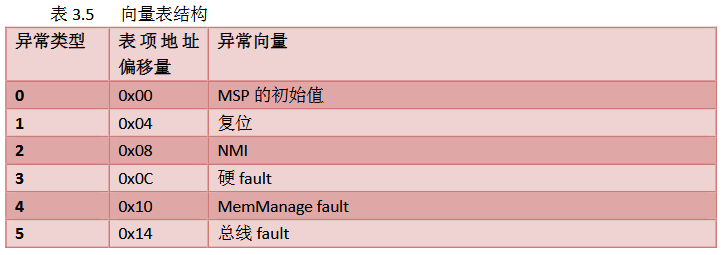
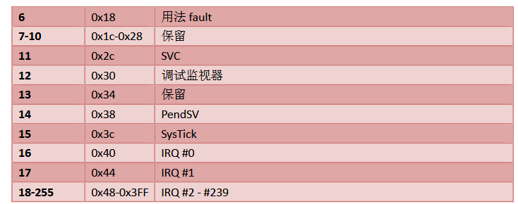
举个例子,如果发生了异常 11(SVC),则 NVIC 会计算出偏移移量是 11x4=0x2C,然后从那里取出服务例程的入口地址并跳入。0 号异常的功能则是个另类,它并不是什么入口地址,而是给出了复位后 MSP 的初值。

Cortex-M3 内核的 32 位地址空间（简化）：
```c
0x0000_0000 ~ 0x1FFF_FFFF  ROM / Flash / 系统内存 / SRAM
0x2000_0000 ~ 0x3FFF_FFFF  SRAM
0x4000_0000 ~ 0x5FFF_FFFF  Peripheral（片上外设寄存器）
0x6000_0000 ~ 0x9FFF_FFFF  External RAM / FSMC
```

| 类型       | 容量    | 位于哪里                    | 访问方式                   |
| -------- | ----- | ----------------------- | ---------------------- |
| 片上 Flash | 64 KB | 内核存储空间（Code / Flash 区域） | CPU 直接访问，像访问内存一样（内存映射） |
STM32F103C8T6 属于低密度 64 KB Flash，**有 64 页**（？）
- 刚好 32 KB * 2 字节？（Flash 是 16 位总线，每单元 2 字节），**手册显示只要 0~31 页**
- 总容量 = 32 页 * 1 KB = 32 KB \*2? 实际就是 64 KB ???

| Device density     | Flash 容量 | 页数    | 每页大小   |
| ------------------ | -------- | ----- | ------ |
| Low-density (C8T6) | 64 KB    | 32 页  | 1 KB/页 |
| Medium-density     | 128 KB   | 128 页 | 1 KB/页 |
| High-density       | 512 KB   | 256 页 | 2 KB/页 |
| XL-density         | 1 MB     | 512 页 | 2 KB/页 |

| 属性       | STM32F103C8T6                          |
| -------- | -------------------------------------- |
| Flash 容量 | 64 KB                                  |
| 数据总线宽度   | 16 位（也就是每个 Flash 单元 2 字节）              |
| 基础访问     | 内存映射，CPU 可直接读取执行                       |
| 擦写单位     | 页（Page）大小 = 1 KB                       |
| 电压       | 2.7 ~ 3.6 V                            |
| 写次数      | 约 10 万次                                |
| 访问方式     | XIP（Execute In Place） + 数据读取 + 寄存器编程写入 |


## Flash 组织结构

**Flash 基地址**：`0x0800_0000 ~ 0x0800_FFFF`（64 KB）
- 这个区域是 CPU **可执行**和**可读取**的
- 写入 Flash 需要走 Flash 控制寄存器（FLASH_CR，图中的 FLITF）


按字节访问
```c
#define FLASH_BASE_ADDR_BYTE ((__IO uint8_t*) (0x08000000))
```

| Page | 起始地址        | 结束地址        |
| ---- | ----------- | ----------- |
| 0    | 0x0800_0000 | 0x0800_03FF |
| 1    | 0x0800_0400 | 0x0800_07FF |
| 2    | 0x0800_0800 | 0x0800_0BFF |
| ...  | ...         | ...         |
| 31   | 0x0800_7C00 | 0x0800_7FFF |
| 32   | 0x0800_8000 | 0x0800_83FF |
| 63   | 0x0800_FC00 | 0x0800_FFFF |


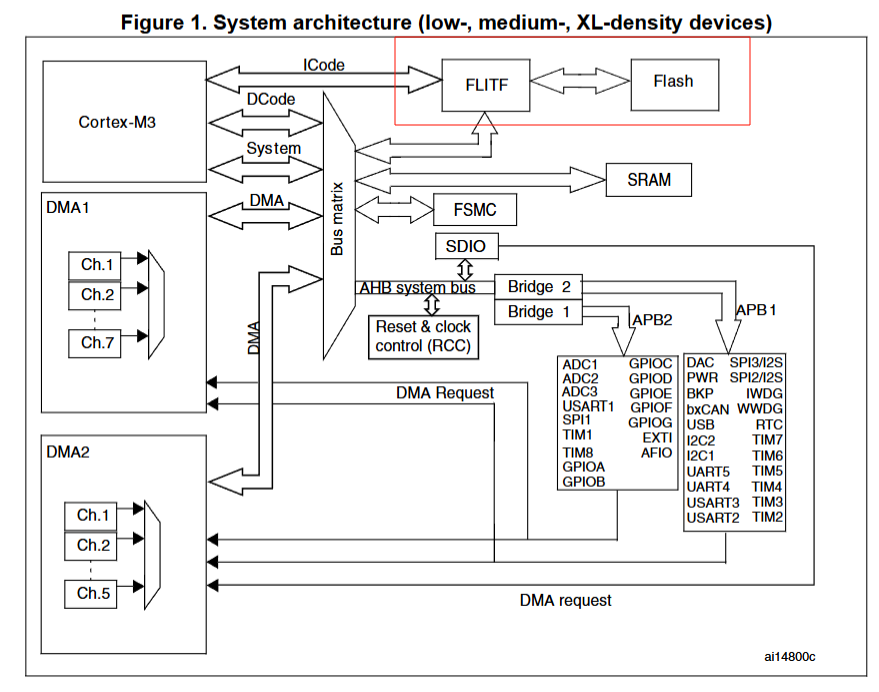
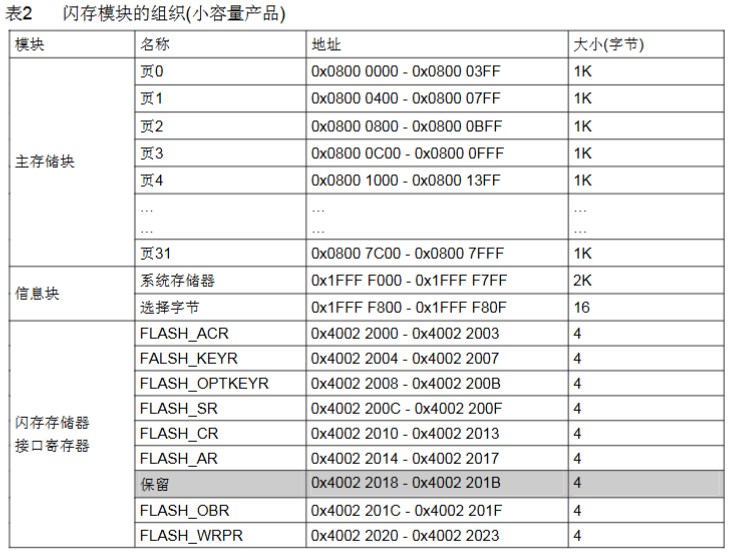

- 主存储器（程序存储器）：用来存放编译后的程序
- 信息快： 又可以分为两个
    1. 启动程序代码 （系统存储器）： 存放原厂写入的BootLoader，用于串口下载
    2. 用户选择字节（选项字节） ：用于存放一些独立的参数
- 闪存存储器接口寄存器：这个的地址是40开头的 ，根据SRAM的地址分配可以看到。闪存存储器接口寄存器是一个外设，与GPIO、定时器、串口等是一个性质的东西。 闪存存储器接口可以理解为上述FLASH闪存的管理员。是用来控制闪存的擦除和编程的

## 访问方式
接口函数见 `Library\stm32f10x_flash.h`
### 注意事项
###### Flash 可保护性，两种保护类型：
1. **Page Write Protection（页写保护）**
	- 可以锁定某些页，禁止写入或擦除。
	- 常用于保护关键程序或配置数据。
2. **Read Protection（读取保护）**
	- 可以禁止外部读出 Flash（如通过调试器读取固件）。
	- 提高固件安全性，防止逆向工程或泄密。

###### Flash 写入时的访问限制
- 当 Flash 正在进行写入或擦除操作时，**CPU 不能访问 Flash**。    
- 如果代码或数据试图从 Flash 读取，会被“挂起”（stall），直到写入/擦除完成

###### Flash 写入/擦除时的时钟要求
- Flash 编程和擦除操作需要 MCU 的 **内部高速 RC 振荡器（HSI, 8 MHz）开启**。    
- Flash 控制器使用 HSI 作为时钟来确保擦写操作的时序可靠。    
- 如果 HSI 关闭，写入或擦除可能失败。

###### Flash 支持 **在编程器烧写** 和 **程序运行时擦写/写入** 两种方式。

###### 每次编程单位为 16 位
- STM32F103 的 Flash 编程单位是 **半字（Half-Word, 16-bit）**。不能直接写入 8 位或 32 位数据，必须按照 16 位半字对齐来写入。
- 如果你有 32 位数据，需要分两次写入。
- 写入非半字会产生总线错误，写入任何非半字的数据，Flash 控制器（FPEC） 都会产生总线错误。

###### PG 位控制写入
“当 FLASH_CR 寄存器的 PG 位为 '1' 时，在一个闪存地址写入一个半字将启动一次编程”
- **FLASH_CR.PG = 1**：Flash 编程使能
- **写入动作触发编程**：
    - 当你给某个地址写入半字（16 位）时，硬件自动启动 Flash 编程
    - 不需要额外命令去“启动”写入
###### ==编程过程中的访问限制==
任何尝试读取 Flash 的操作都会 **挂起 CPU**，直到 Flash 编程完成
“在编程过程中（BSY 位为 '1'），任何读写闪存的操作都会使 **CPU 暂停**，直到此次闪存编程结束。”

### 解锁（读取无须解锁）
|名称|英文名|位宽|字节数|典型用途举例|
|:--|:--|:--|:--|:--|
|字节|byte|8 bit|1|`uint8_t`、字符|
|半字|half-word|16 bit|2|`uint16_t`、STM16 位寄存器|
|字|word|32 bit|4|`uint32_t`、32 位寄存器、栈对齐单位|
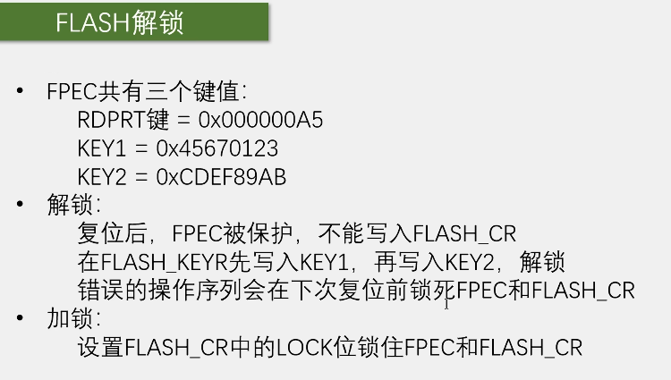
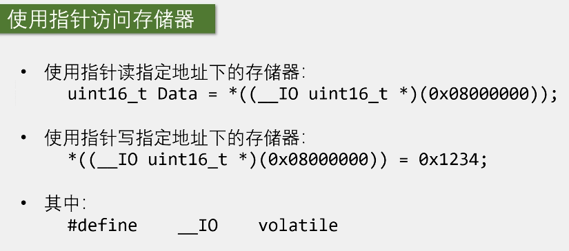

### 读取
内存映射，CPU 可以直接访问：
```c
uint32_t data = *(volatile uint32_t*)(0x08000000); // 读取 Flash 首地址
```
- 16 位总线，CPU 可以按 16 位或 32 位读取
- 支持 XIP（Execute In Place），可以直接执行代码
        
### 写入 / 擦除
- 必须通过 **Flash 控制器寄存器**：	
	- `FLASH->CR` 控制寄存器		
	- `FLASH->SR` 状态寄存器		
	- `FLASH->AR` 地址寄存器		
	- `FLASH->DR` 数据寄存器		
- 擦写单位是 **页（Page）**：	
	- C8T6：1 页 = 1 KB		
- 写入单位是 **16 位**，地址必须对齐

#### Flash 解锁
```c
// FLASH_KEY1 = 0x45670123
// FLASH_KEY2 = 0xCDEF89AB
if (FLASH->CR & FLASH_CR_LOCK) {      // 如果被锁定
    FLASH->KEYR = 0x45670123;         // 写入钥匙1
    FLASH->KEYR = 0xCDEF89AB;         // 写入钥匙2
}

```

#### 擦除 Flash 页
`pageAddress` 必须是 **页首地址**，例如 Page 0 = `0x0800_0000`，Page 31 = `0x0800_7C00`
```c
void Flash_ErasePage(uint32_t pageAddress) {
    while (FLASH->SR & FLASH_SR_BSY); // 等待上次操作完成

    FLASH->CR |= FLASH_CR_PER;        // 选择页擦除模式
    FLASH->AR = pageAddress;          // 设置页地址
    FLASH->CR |= FLASH_CR_STRT;       // 开始擦除

    while (FLASH->SR & FLASH_SR_BSY); // 等待擦除完成
    FLASH->CR &= ~FLASH_CR_PER;       // 关闭页擦除模式
}

```
#### 写入 Flash（16 位）
注意：
- 写入地址必须 **16 位对齐**
- 写入前通常先擦除页，否则 Flash 无法直接覆盖旧数据
```c
void Flash_WriteHalfWord(uint32_t address, uint16_t data) {
    while (FLASH->SR & FLASH_SR_BSY); // 等待上次操作完成

    FLASH->CR |= FLASH_CR_PG;         // 开启编程模式

    *(volatile uint16_t*)address = data; // 写入 16 位数据

    while (FLASH->SR & FLASH_SR_BSY); // 等待写入完成
    FLASH->CR &= ~FLASH_CR_PG;        // 关闭编程模式
}

```

#### 写入多个半字（批量写）
- 每个元素 16 位，占 2 字节
- 地址递增时乘以 2
```c
void Flash_WriteBuffer(uint32_t startAddress, uint16_t* buffer, uint32_t length) {
    for (uint32_t i = 0; i < length; i++) {
        Flash_WriteHalfWord(startAddress + i*2, buffer[i]);
    }
}

```
#### Flash 锁定（可选）
```c
FLASH->CR |= FLASH_CR_LOCK; // 防止误写
```

## 代码示例

`FLASH.h`

```c
#ifndef __FLASH_H__
#define __FLASH_H__

#include "stm32f10x.h"

#define FLASH_BASE_ADDR (uint32_t)(0x08000000)
#define FLASH_BASE_PTR ((__IO uint32_t*) (FLASH_BASE_ADDR))
#define FLASH_PAGE_BYTE_NUM (0x00000400) // 1 KB，1024 字节 = 256 字
#define FLASH_PAGE_WORD_NUM FLASH_PAGE_BYTE_NUM / sizeof(uint32_t) // 对于字读，每页的偏移(字)数 = 256
#define FLASH_PAGE_NUM 64 // 64 页，STM31F103CT6的页数（64k）

// FLASH_BASE_PTR[0]  -> 0x08000000
// FLASH_BASE_PTR[1]  -> 0x08000004
// FLASH_BASE_PTR[256]-> 0x08000400  (Page 1 起始)

// #define     __IO    volatile   

// 读取字
uint32_t FLASH_ReadWord(uint32_t addr);
// 读取半字
uint16_t FLASH_ReadHalfWord(uint32_t addr);
// 读取字节
uint8_t FLASH_ReadByte(uint32_t addr);

void UserFLASH_EraseAllPages(void);
void UserFLASH_ErasePage(uint8_t pageBegin, uint8_t pageNum);
// 从指定页开始写数据
void UserFLASH_WriteFromPage(uint32_t pageBegin, uint32_t *wdata, uint32_t wlen);
// 从指定地址开始写数据, 字节对齐
void UserFLASH_Write(uint32_t addr, uint32_t *wdata, uint32_t wlen);

#endif /* __FLASH_H__ */

```

`FLASH.c`
注意参数 `uint32_t Page_Address` 是字节寻址，而不是字，即偏移地址是按字节算
```c
#include "stm32f10x.h"
#include "FLASH.h"
#include "Log.h"

// 字读
uint32_t FLASH_ReadWord(uint32_t addr)
{
    return FLASH_BASE_PTR[addr];
}

uint16_t FLASH_ReadHalfWord(uint32_t addr)
{
    return ((uint16_t*)FLASH_BASE_PTR)[addr] & 0xFFFF;
}

// 字节读
uint8_t FLASH_ReadByte(uint32_t addr)
{
    return ((uint8_t*)FLASH_BASE_PTR)[addr] & 0xFF;
}

// typedef enum
// {
//   FLASH_BUSY = 1,
//   FLASH_ERROR_PG,
//   FLASH_ERROR_WRP,
//   FLASH_COMPLETE,
//   FLASH_TIMEOUT
// }FLASH_Status;
void UserFLASH_EraseAllPages(void)
{
    FLASH_Unlock();
    // 擦除页
    if (FLASH_EraseAllPages() != FLASH_COMPLETE)
        // 关闭FMC写操作
        FLASH_Lock();
}

void UserFLASH_ErasePage(uint8_t pageBegin, uint8_t pageNum)
{
    // FLASH_Status FLASH_ErasePage(uint32_t Page_Address);
    FLASH_Unlock();
    // ！！！是字节数而不是“字数偏移” -> 每页偏移 FLASH_PAGE_BYTE_NUM 1024 字节
    for(uint8_t i = 0; i < pageNum; i++){
        FLASH_ErasePage(FLASH_BASE_ADDR + (pageBegin + i) * FLASH_PAGE_BYTE_NUM);
    }
    // 关闭FMC写操作
    FLASH_Lock();
}

void UserFLASH_WriteFromPage(uint32_t pageBegin, uint32_t *wdata, uint32_t wlen)
{
    // 一次写4字节，地址每次增加4字节
    if (wlen % 4 != 0)
    {
        LOG("wlen must be multiple of 4");
        return;
    }
    FLASH_Unlock();
    for (uint32_t i = 0; i < wlen / 4; i++)
    {
        FLASH_ProgramWord(FLASH_BASE_ADDR + pageBegin * FLASH_PAGE_BYTE_NUM + (i * 4), wdata[i]);
    }
    // 关闭FMC写操作
    FLASH_Lock();
}

void UserFLASH_Write(uint32_t addr, uint32_t *wdata, uint32_t wlen)
{
    // 一次写4字节，地址每次增加4字节
    if (wlen % 4 != 0)
    {
        LOG("wlen must be multiple of 4");
        return;
    }
    FLASH_Unlock();
    for (uint32_t i = 0; i < wlen / 4; i++)
    {
        FLASH_ProgramWord(FLASH_BASE_ADDR + addr + (i * 4), wdata[i]);
    }
    // 关闭FMC写操作
    FLASH_Lock();
}

```

`main.c`
```c
#include "UserUSART.h"
// #include "AT24C256.h"
// #include "W25Q64.h"
// #include "UserSPI.h"
#include "FLASH.h"
#include "Log.h"

int main(void)
{
    User_USART_Init();
    // User_IIC_Init();
    // OLED_Init();
    // W25Q64_Init();

    printf("HelloWorld!\n");

    UserFLASH_ErasePage(60, 1); //先擦除再读
    uint32_t wdata[3] = {0x9ABCDEF0, 0x01234567, 0x01234567}; // 共 3 字，12 字节
    UserFLASH_WriteFromPage(60, wdata, 12);
    // 下面读一个字
    printf("%08x\r\n", FLASH_ReadWord(60 * FLASH_PAGE_WORD_NUM)); // 字读则字偏移
    printf("%08x\r\n", *(uint32_t *)(FLASH_BASE_ADDR + 60 * FLASH_PAGE_BYTE_NUM)); // 字节读则字节偏移
    printf("%08x\r\n", FLASH_ReadWord(60 * FLASH_PAGE_WORD_NUM + 1)); // 字读则字偏移
    printf("%08x\r\n", *(uint32_t *)(FLASH_BASE_ADDR + 60 * FLASH_PAGE_BYTE_NUM + 4)); // 字节读则字节偏移
    
    // printf("%08x\r\n", *(uint32_t *)(FLASH_BASE_ADDR + 60 * FLASH_PAGE_BYTE_NUM)); // 字节读则字节偏移
    // 可以换成
    // uint8_t FLASH_ReadByte(60 * FLASH_PAGE_BYTE_NUM)
}
```

输出结果
```c
# RECV ASCII/40 <<<
9abcdef0
9abcdef0
01234567
01234567
```


# BootLoader 和 寄存器组
## 介绍
`Start\startup_stm32f10x_md.s`

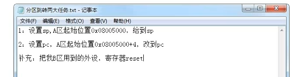

Cortex-M3 R0~R15寄存器组 & 特殊功能寄存器组

R0~R15寄存器组
Cortex-M3处理器拥有R0~R15的寄存器组，如：  
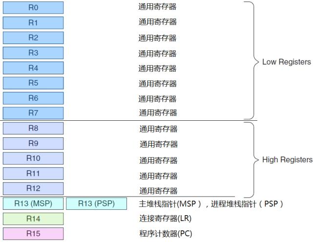

**R0~R12通用寄存器**
1. 通用目的寄存器 R0-R7  
	R0‐R7 也被称为低组寄存器。所有指令都能访问它们。它们的字长全是 32 位,复位后的初始值是不可预料的。
2. 通用目的寄存器 R8-R12  
	R8‐R12 也被称为高组寄存器。这是因为只有很少的 16 位 Thumb 指令能访问它们,32  位的指令则不受限制。它们也是 32 位字长,且复位后的初始值是不可预料的。
	
R0~R12都是32位通用寄存器，用于数据操作。其中：
- R0~R7为低组寄存器，所有的指令都可以访问。
- R8~R12为高组寄存器，只有32位Thumb2指令和很少的16位Thumb指令能访问。

**R13堆栈指针SP** 
Cortex-M3拥有两个堆栈指针，然而它们是banked，任一时刻只能使用其中的一个。
- 主堆栈指针（MSP）：复位后缺省使用的堆栈指针，用于操作系统内核以及异常处理（包括中断服务）。
- 进程堆栈指针（PSP）：由用户的应用程序代码使用。

**R14连接寄存器LR**  
连接寄存器LR用于在调用子程序时存储返回地址。例如，在使用BL（分支变连接，Branch and Link）指令时，就自动填充LR的值。

```c
main            ;主程序
    ...
    BL        function1 ; 使用“分支并连接”指令调用function1
                        ; PC=function1，并且LR=main的下一条指令地址
    ...

function1
    ...            ; function1的代码
    BX LR        ; 函数返回（如果function1要使用LR，必须使用前PUSH，
                ; 否则返回时程序就可能跑飞了）
```

ARM为了减少访问内存的次数（访问内存的操作往往需要3个以上指令周期，带MMU和cache的就更加不确定了），把返回地址直接存储在寄存器中。这样足以使很多只有1级子程序调用的代码无需访问内存（堆栈内存），从而提高了子程序调用的效率。如果多于1级，则需要把前一级的R14值压到堆栈里。  
在ARM上编程时，应尽量只使用寄存器保存中间结果，迫不得已才访问内存。  
在RISC处理器中，为了强调访问内存操作越过了处理器的界线，并且带来了对性能的不利影响，给它取了一个专业的术语：溅出。

**R15程序计数寄存器PC**
程序计数寄存器PC指向当前的程序地址。如果修改它的值，能改变程序的执行流。
因为Cortex-M3内部使用了指令流水线，读PC时返回的值时当前指令的地址值+4，如：

```c
0x1000：    MOV R0, PC    ; R0 = 0x1004
```

如果向PC中写数据，就会引起一次程序的分支（但是不更新LR寄存器）。  
Cortex-M3中的指令至少是半字（2字节）对齐的，所以PC的LSB总是读回0。然而，在分支时，无论是直接写PC的值还是使用分支指令，都必须保证加载到PC的数值是奇数（即LSB=1），用以表明这是在Thumb状态下执行。如若写了0，则视为企图转入ARM模式，Cortex-M3将产生一个fault异常。


**特殊功能寄存器组**
Cortex-M3中的特殊功能寄存器包括：
- 程序状态寄存器组（PSRs/xPSR）
- 中断屏蔽寄存器组（PRIMASK、FAULTMASK以及BASEPRI）
- 控制寄存器（CONTROL）

它们只能被专用的MSR/MRS指令访问，而且它们也没有与之相关联的访问地址。如：  
MRS <gp_reg>, <special_reg> ; 读特殊功能寄存器的值到通用寄存器  
MSR <special_reg>, <gp_reg> ; 写通用寄存器的值到特殊功能寄存器

**程序状态寄存器PSRs/xPSR**
程序状态寄存器在其内部又被分为三个子状态寄存器：
- 应用程序PSR（APSR）：
- 中断号PSR（IPSR）：
- 执行PSR（EPSR）：

如：  
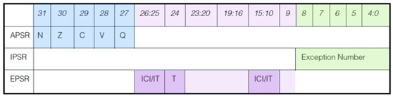
xPSR：
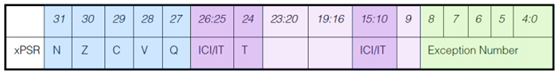


通过MRS/MSR指令，这3个PSRs即可以单独访问，也可以组合访问（2个组合，3个组合都可以）。
当使用三合一的方式访问时，应使用名字“xPSR”或者“PSR”。

**中断屏蔽寄存器PRIMASK、FAULTMASK、BASEPRI**
中断屏蔽寄存器组（PRIMASK、FAULTMASK以及BASEPRI）用于控制“异常”的使能（enable）和除能（disable）。
- PRIMASK：这是个只有单一比特的寄存器。当它被置1后，就关掉所有可屏蔽的异常中断，只剩下NMI和硬fault可以响应。它的缺省值为0，表示没有关中断。
- FAULTMASK：这是个只有单一比特的寄存器。当它被置1后，只有NMI才能响应，所有其他的异常中断包括硬fault都不会响应。它的缺省值为0，表示没有关异常。
- BASEPRI：这个寄存器最多有9位（由表达优先级的位数决定）。它定义了被屏蔽优先级的阈值。当它被设成某个值后，所有优先级号大于等于此值得中断都被关闭（优先级号越大，优先级越低）。但如果被设为0，则不关闭任何中断。它的缺省值为0。

要访问PRIMASK、FAULTMASK、BASEPRI寄存器，同样需要使用MRS/MSR指令，并且只有在特权级下，才允许访问这3个寄存器。  
如：  
MRS R0, BASEPRI ; 读取BASEPRI到R0中  
MRS R0, FAULTMASK ; 读取FAULTMASK到R0中  
MRS R0, PRIMASK ; 读取PRIMASK到R0中  
MSR BASEPRI, R0 ; 写入R0到BASEPRI中  
MSR FAULTMASK, R0 ;  
MSR PRIMASK, R0 ;

只有在特权级下，才允许访问这3个寄存器

**控制寄存器CONTROL**
控制寄存器有两个用途，其一用于定义特权级别（CONTROL[0]），其二用于选择当前使用哪个堆栈指针（CONTROL[1]）。  
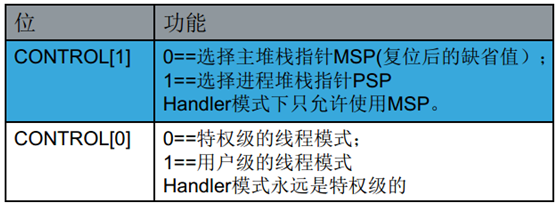

CONTROL[0]：
- 0 = 特权级的线程模式
- 1 = 用户级的线程模式

Handler模式永远都是特权级的。  
CONTROL[1]：
- 0 = 选择主堆栈指针MSP（复位后的缺省值）
- 1 = 选择进程堆栈指针PSP

Handler模式下只允许使用MSP。
由于Handler模式下用于都是特权级的，且只允许使用MSP；可见这个寄存器主要用于“线程模式”下的设置。
在线程模式下，可设置为特权级的线程模式或非特权级的线程模式；使用MSP或使用PSP。

## BootLoader
### 查看代码文件占用的空间大小和地址。
双击 Target_1，或者在项目文件夹下的 Listings 文件夹里的 `Project.map` 文件查看。
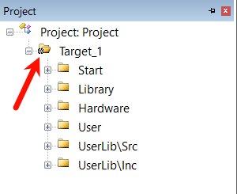

FLASH
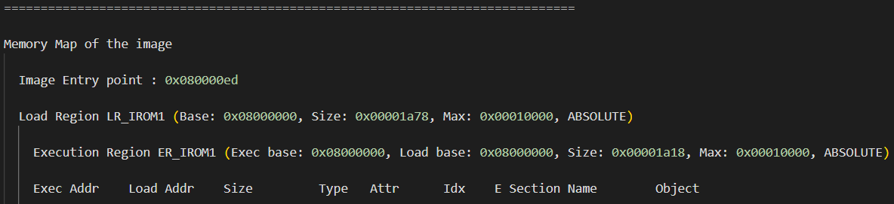

RAM（栈+数据）
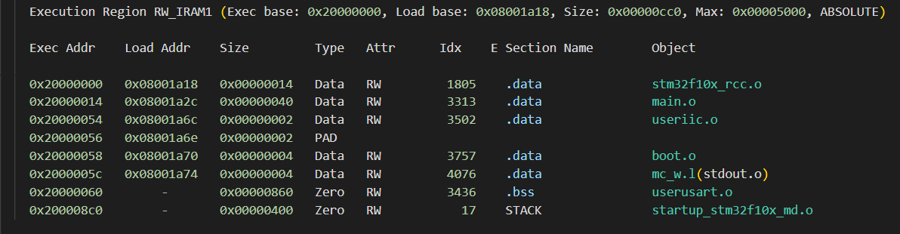

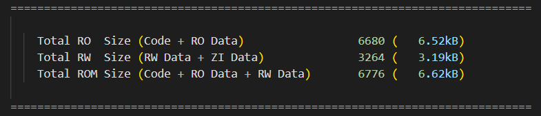

1. 总结 Memory Map 中的大小
	- **RO（Read-Only）**：代码 + 常量数据 → 存在 Flash
	- **RW（Read-Write）**：初始化的全局变量 + 未初始化变量 → 占用 RAM
	- **Total ROM Size**：Flash 总占用 = RO + RW 初始化数据在 Flash 中的存储空间
	    - 注意 `.data` 的初始值也在 Flash 中，所以 Total ROM Size = 6680 + 差额 ≈ 6776 bytes
2.  Flash 占用 （Size: 0x00001a78 => `0x0800 0000 ~ 0x0800 1a78`）
	- **RO Size**：6680 bytes → `.text` + `.rodata`
	- **RW Size**：RW 数据在 Flash 中存储初始化值（Load Region） = Total ROM Size - RO Size = 6776 - 6680 = 96 bytes
	- **总共烧录到 Flash**：6776 bytes ≈ 6.62 KB
3. RAM 占用（栈+数据）（Size: 0x00000cc0 => `xxx - 0cc0 ~ xxx` ， STM32/ARM Cortex-M 系列的栈是 **向低地址增长** 的）
	```c
	RAM (0x20000000 ~ 0x20005000, 20 KB)
	+-------------------------------+ 0x20005000
	|           栈                 | ↑ 向下增长
	|-------------------------------|
	|                               |
	|      空闲 / 堆（如果使用）     |
	|                               |
	|-------------------------------|
	|       .bss / .data (RW/ZI)    | 0x20000000 ~ 0x20000CC0
	+-------------------------------+ 0x20000000
	
	```
	- **RW Data + ZI Data** = 3264 bytes ≈ 3.19 KB
	    - RW Data → `.data` 段（初始化变量）
	    - ZI Data → `.bss` 段（未初始化变量）
	- 栈没有显示在 Memory Map 中，但 RAM 剩余空间 = 总 SRAM - RW Size - 堆（如使用）
	    - 例如 STM32F103C8 有 20 KB RAM
	    - 使用 3264 bytes 用于全局变量 → 剩下约 16.8 KB 可供堆/栈使用
	- 栈大小通常由链接脚本定义（例如 `_estack` 起始地址）
	    - RAM 高地址为栈顶，程序向低地址增长

##### ROM
###### 1. Image Entry Point（仅供参考）
`Image Entry point : 0x080000ed`
- 表示程序的 **入口地址**    
- CPU 上电或跳转到应用时，会从这个地址开始执行    
- 0x080000ED 通常是 **复位向量表中的 Reset_Handler 地址**    
- 对应链接器生成的 `.text` 段起始偏移    
###### 2. Load Region（LR）
`Load Region LR_IROM1 (Base: 0x08000000, Size: 0x00001a78, Max: 0x00010000, ABSOLUTE)`
- **LR_IROM1**：Flash 中存放程序的 **加载区域**（Load Region）    
- **Base 0x08000000**：Flash 起始地址    
- **Size 0x00001A78**：程序实际在 Flash 占用的大小（0x1A78 = 6776 bytes）    
- **Max 0x00010000**：分配给该区域的最大空间（0x10000 = 64KB Flash）    
- **ABSOLUTE**：地址是绝对地址，不是偏移
> Load Region 指的是 **二进制实际存放在 Flash 的位置**。
###### 3. Execution Region（ER）
`Execution Region ER_IROM1 (Exec base: 0x08000000, Load base: 0x08000000, Size: 0x00001a18, Max: 0x00010000, ABSOLUTE)`
- **ER_IROM1**：程序实际 **执行的区域**（Execution Region）    
- **Exec base 0x08000000**：CPU 执行的起始地址    
- **Load base 0x08000000**：二进制被加载在 Flash 的起始地址    
- **Size 0x00001A18**：程序的执行大小（0x1A18 = 6680 bytes）    
- **Max 0x00010000**：该执行区域最大允许大小    
- **ABSOLUTE**：绝对地址    
> Execution Region 指的是 **CPU 运行时需要访问的地址空间**，有时候会比 Load Region 小（例如 `.data` 初始化数据在 RAM，`.text` 在 Flash）。
###### 4. Load Size vs Execution Size 差异
- Load Size: 0x1A78 = 6776 bytes    
- Execution Size: 0x1A18 = 6680 bytes    
- 差值 0x60 = 96 bytes    
- 这个差距通常是 `.data` 或其他初始化数据需要从 Flash 拷贝到 RAM    
- CPU 执行 `.text` 时不需要这些拷贝数据占用空间，所以 Execution Size 小一些

##### RAM
###### 1. Execution Region RW_IRAM1
`Execution Region RW_IRAM1 (Exec base: 0x20000000, Load base: 0x08001a18, Size: 0x00000cc0, Max: 0x00005000, ABSOLUTE)`
- **RW_IRAM1**：可读写（RW）的 RAM 执行区域    
- **Exec base 0x20000000**：CPU 执行或访问该区域的地址 → 对应 STM32 的 SRAM 起始地址    
- **Load base 0x08001a18**：该段在 Flash 中的加载地址 → CPU 启动时从 Flash 拷贝到 RAM    
- **Size 0x00000CC0**：该段大小（0xCC0 = 3264 bytes）    
- **Max 0x00005000**：允许最大分配空间（0x5000 = 20 KB SRAM）    
- **ABSOLUTE**：绝对地址    
> 简单理解：这个区域一般包括 `.data` 段和其他初始化变量，CPU 执行时在 SRAM 访问，但程序二进制存放在 Flash。
###### 2. Exec Addr vs Load Addr
- **Exec Addr**（0x20000000）    
    - CPU 使用的地址，RAM 中        
    - `.data` 段初始化后存放在这里        
- **Load Addr**（0x08001A18）    
    - 程序二进制在 Flash 中的存储地址        
    - 启动时，启动代码会把 Load Addr 的内容拷贝到 Exec Addr        
###### 3. Size vs Max
- **Size = 0xCC0 (3264 bytes)**    
    - 该段实际占用 SRAM 大小        
- **Max = 0x5000 (20 KB)**    
    - 分配给该区域的最大可用 RAM 空间        
- 差值空间通常是未使用的 SRAM，可用于其他全局变量、堆或栈

###### 4. 类型说明
- **RW** → 可读写    
- **IRAM** → 位于内部 SRAM（Internal RAM）    
- **Exec base** → CPU 使用地址    
- **Load base** → Flash 加载地址   
通常对应 `.data` 段，即**初始化全局变量**：
1. 编译后，初始值存放在 Flash    
2. 上电复位后，启动代码把 Flash 拷贝到 RAM    
3. CPU 访问变量时，从 RAM 执行读写

### 前言

###### 程序运行简言
- 程序（APP 和 Bootloader）存放在 Flash（0x08000000）中，不是在 SRAM。
- 向量表（Vector Table）也是保存在 Flash 里的，程序开头的前 0x0800 0000~0x0800 0100 字节左右。
- 运行并不是自动从 Flash 拷贝到 SRAM —— Cortex-M3 的取指令总线可以直接访问 Flash，可以直接在 Flash 取指令执行，不需要像电脑那样把程序加载到 RAM 再执行。数据要跑时，有些会初始化到 SRAM，但代码本身还是在 Flash 执行。
- 对于 STM32F103C8T6：
	```c
	Flash 起始：0x0800 0000  
	大小：64 KB
	```
	自定义的 bootloader、APP 的所有指令、常量，都塞在 Flash。**Flash 就是在 MCU 里面的一个存储芯片（ROM），CPU 可以直接从里面取指令执行。**
- SRAM，STM32F103C8T6 的 SRAM：
	```c
	SRAM 起始：0x2000 0000  
	大小：20 KB（0x5000）
	```
	SRAM 主要用于：
	- 栈（Stack）
	- 全局变量（RW）
	- 初始化后的变量（如 int a = 3）
	- 运行中需要的临时内存（heap）
	- **代码**不会自动放到 SRAM 执行。（除非你自己实现）

###### SRAM，ROM，MSP 的关系
1. ROM
	- 地址 `0x08000000`：Bootloader 的向量表
	    - `*(uint32_t*)0x08000000`：Bootloader 的初始 MSP
	    - `*(uint32_t*)0x08000004`：Bootloader 的 Reset_Handler
	- APP 位于 A 区，例如 0x08005000
	    - `*(uint32_t*)0x08005000`：APP 的 MSP        
	    - `*(uint32_t*)0x08005004`：APP 的 Reset_Handler
	FLASH（ROM） 存放向量表，然后是代码等，对于 Bootloader，起始地址是 `0x0800 0000 `，且 `*(uint32_t*)(0x08000000) = MSP`，然后是中断向量函数，跳转到 A 区需要重新设置 MSP 为 APP 的起始地址的值，而且程序运行的偏移地址也需要修改程序运行的偏移地址
	```c
	    SCB->VTOR = 0x08005000; // 如果没修改 Start\system_stm32f10x.c  里的 #define VECT_TAB_OFFSET  0x0 为 0x5000，在bootloader里设置会被启动文件覆盖不起作用
	```

2. SRAM 的起始地址是 0x20000000，**假设** SRAM 的结束地址是 0x20005000，
	程序初始化时 RW Data → `.data` 段（初始化变量），ZI Data → `.bss` 段（未初始化变量）**从 SRAM 的起始地址开始放**
	**栈向下增长，堆向上增长**
	
	- 堆的数据是往上增长的，在 STM32F1 这类 MCU 中，20 KB RAM，一般全局变量占用 3~4 KB → 剩余 16 KB 可分配给堆/栈。（malloc/new 使用）
	- 栈是向下增长的，MSP （主栈指针）的值是 0x20005000 （假设）
		- push: `MSP -= 4; *(MSP) = data`
		- pop: `data = *(MSP); MSP += 4`

3. （**MSP 的初始值是由“中断向量表”决定的**）因此跳转 APP 时需要把 APP 存放在 FLASH 的首地址**的值**设置给 MSP，即
	```c
	__asm void SetMainStackPointer(uint32_t stackAddr)
	{
	    MSR MSP, r0        ; MSP = r0
	    BX  lr             ; return
	}
	```


```c
RAM (0x20000000 ~ 0x20005000, 20 KB)
+-------------------------------+ 0x20005000  MSP的值是这里
|           栈                  | 
|-------------------------------|
|                               |
|      空闲 / 堆（如果使用）     |
|                               |
|-------------------------------|
|       .bss / .data (RW/ZI)    | 0x20000000 ~ 0x20000CC0
+-------------------------------+ 0x20000000
```

| 区域    | 用途             | 谁操作                  |
| ----- | -------------- | -------------------- |
| .data | 已初始化全局变量       | 由启动代码从 flash 拷贝到 RAM |
| .bss  | 未初始化全局变量（清零）   | 启动代码清零               |
| 堆     | 动态内存           | malloc / free        |
| 栈     | 函数调用、局部变量、保存现场 | MSP/PSP 自动管理         |

###### MSP（Main Stack Pointer）是什么？为什么必须先设置 MSP？
MSP 是 Cortex-M3 的 **主栈指针寄存器（Stack Pointer）**
栈（Stack）用于：
- 保存返回地址
- 保存局部变量
- 保存中断现场
- 函数调用/返回全部依赖栈
    
如果 **栈指针错误** → 程序直接 HardFault。
###### Reset_Handler 是什么？为什么是程序真正的入口？
Reset_Handler 是程序开始执行的第一行代码（APP 的 main 之前），PC 指针应该指向这里
Reset_Handler 负责：
1. 初始化栈、堆
2. 复制 .data 段到 SRAM
3. 清零 .bss
4. 初始化 C 库
5. 调用 `main()`
    

所以程序流程正确的是：

###### 向量表到底是什么
向量表是 **程序前 8 字节 + 一堆中断入口地址表**，格式固定：

| 地址            | 内容                       |
| ------------- | ------------------------ |
| `addr + 0x00` | 初始 MSP（栈指针初始值）           |
| `addr + 0x04` | Reset_Handler（复位函数地址），PC |
| `addr + 0x08` | NMI_Handler              |
| `addr + 0x0C` | HardFault_Handler        |
| ...           | 更多中断                     |
###### CPU 上电后做了什么
Cortex-M3 上电后 **不需要任何系统加载程序，不需要 BIOS，不需要 bootloader**。干两件事：
1. **读取 Flash[0]** → 设置 MSP（栈指针）
2. **读取 Flash[4]** → 跳到 Reset_Handler 执行程序

这两个地址就是 Flash 的向量表前两个字。所以程序能启动，全靠“向量表”。

###### Bootloader 跳 APP 是怎么回事？
bootloader 里的动作就是照着 CPU 启动流程模拟一次。假设我需要跳转到 APP（APP代码同样是存放在 FLASH） 运行
```c
uint32_t app_stack = *(uint32_t*)app_addr;      // 获取 APP 的初始栈指针
uint32_t app_reset = *(uint32_t*)(app_addr+4);// 获取 APP 入口（reset handler）

SetMainStackPointer(app_stack);   // 设置 MSP
g_app_entry = (AppEntryFunc)reset; // 转换为函数指针形式，应该是 void 形式的
g_app_entry(); // 跳转到 APP
```

**注意区分地址和值**： APP **向量表第 0 项** （假设地址 app_addr 为 0x08000500）存放的是 `app_stack` ，而 `app_stack = *(0x08000500)`，是地址 0x08000500 存放的值，这个值是 APP 代码的初始 MSP，这个值是一个地址，位于栈
```c
uint32_t app_stack = *(uint32_t*)(APP_ADDR + 0);       // 向量表第0项的值
uint32_t app_reset = *(uint32_t*)(APP_ADDR + 4);       // 向量表第1项的值
```

```c
┌──────────────────────────────────────────────────────────────┐
│                       STM32 MCU Memory                        │
└──────────────────────────────────────────────────────────────┘

Flash 0x08000000 （bootloader）,这里 地址:值 表示该地址存放的值是...
┌────────────────────────────────────────┐
│ 下面是向量表（前 0x100 字节）            │
│  0x00 : MSP 初值 (比如 0x20005000)       │
│  0x04 : Reset_Handler 地址，PC           │
│  0x08 : NMI_Handler                      │
│  ...                                   │
├────────────────────────────────────────┤
│ 程序代码(.text)                        │
├────────────────────────────────────────┤
│ 常量(.rodata)                          │
└────────────────────────────────────────┘

对于APP代码的FLASH，假设存放起始地址是 0x08000500  
FLASH
┌─────────────────────────────────────────────┐
│              [向量表]                       │
│ 0x08000500 → 第0项: 初始 MSP 值             │
│              第1项: Reset_Handler 地址      │ 
│              第2项: NMI_Handler             │
│              第3项: HardFault_Handler       │
│              ...                            │
├─────────────────────────────────────────────┤
│ 0x08000500 + n → APP 的真正代码段           │
│                （函数、变量、main等）       │
└─────────────────────────────────────────────┘


SRAM 0x20000000
┌────────────────────────────────────────┐
│ 栈 Stack（从高地址往下增长）             │
├────────────────────────────────────────┤
│ 全局变量 / 静态变量 (.data/.bss)        │
├────────────────────────────────────────┤
│ 堆 Heap（malloc）                      │
└────────────────────────────────────────┘

```

###### 向量表第 0 项（MSP）是谁生成的
**由编译器 + 启动文件 startup_xxx.s 自动生成并放入 Flash 的。** 链接脚本决定向量表的位置（你设置为 0x08000500）。一旦我们把 APP代码烧写到 FLASH，假设烧写起始地址是 0x08000500，那么可以通过 `*(0x08000500)`，得到的是 MSP 的“初始值（也就是 APP 栈的起始地址）
栈实际“放变量、压函数参数”等操作 **都发生在 SRAM 里的这个地址开始往下增长**。
例如：pop  → MSP 增大，push → MSP 减小
```c
MSP = 0x20005000    // 栈顶 ，从高地址向低地址变化
push 操作 → MSP = 0x20004FFC
push 操作 → MSP = 0x20004FF8
...
```
为什么要这样设计？
让堆（heap）和栈（stack）同时存在并避免冲突，在几乎所有嵌入式系统中：
- **栈从 SRAM 顶部向下增长**
- **堆从 SRAM 底部向上增长**
```c
SRAM 高地址
|---------------------|
|       栈（向下）    |
|---------------------|
|         ↑           |
|         | 避免互相打架
|         ↓           |
|---------------------|
|       堆（向上）    |
|---------------------|
SRAM 低地址

```
### 函数指针入口
```c
typedef void (*AppEntryFunc)(void);
```
- `typedef`：给类型起一个别名。
- `void (*AppEntryFunc)(void)`：
    - `*AppEntryFunc`：这是一个 **函数指针** 类型。
    - `(void)`：函数 **没有参数**。
    - `void`（最前面）：函数 **没有返回值**。
`AppEntryFunc` 是一个类型，表示指向 **无参数、无返回值函数** 的指针。换句话说，如果有一个函数 `void ResetHandler(void);`，你可以用 `AppEntryFunc` 类型来保存它的地址。

使用函数指针
```c
AppEntryFunc g_appEntry = NULL; // 全局变量
/* 5. 跳转到应用程序的 Reset_Handler */
g_appEntry = (AppEntryFunc)appResetHandler;
g_appEntry();
```
- `appResetHandler` 是一个 `uint32_t`，存储的是应用程序 **Reset_Handler 的地址**。
- `(AppEntryFunc)`：把这个地址 **强制转换** 为函数指针类型。
- `g_appEntry`：现在是一个 **函数指针变量**，指向应用程序的入口函数。

通过 `g_appEntry()` 就可以像调用普通函数一样跳转执行应用程序的 `Reset_Handler`。

### 汇编函数 SetMainStackPointer：设置 MSP（主堆栈指针）
```c
/* 设置 MSP 的汇编函数 */
__asm void SetMainStackPointer(uint32_t stackAddr)
{
    MSR MSP, r0        ; MSP = r0
    BX  lr             ; return
}

```
 作用：把传入的 addr 设置为 MSP（Main Stack Pointer）
 - ARM64 下的指令助记符 `MSR` / `MRS`，语义是 Move **System register** to/from general register
- `r0`：存放参数 `addr`
- `MSR MSP, r0`：把 `r0` 的值写入到 MSP 寄存器中  → 即 “设置堆栈顶指针”
 然后返回
	`BX r14` = 返回到 C 函数

一些解释
- 这是内联汇编（或裸汇编）函数。注意：虽然函数**形式上写了参数名 `addr`，但在 ARM 的调用约定里，调用时第一个参数已经被放进寄存器 `r0`，所以函数体直接用 `r0` 就能得到 `addr` 的值。这是为什么看起来“addr 没用”的原因 —— 它是隐式通过 r0 使用的。**
- `MSR MSP, r0`：把 `r0` 的内容写入特殊寄存器 MSP（Main Stack Pointer）。也就是把栈指针设置为 `r0` 的值。
- `BX r14`：`BX` 是分支并切换指令，这里 `r14` 是 LR（链接寄存器）。**调用这个 asm 函数时，LR 保存了返回地址，`BX r14` 表示函数返回（等同于 `return;`）**。
- 所以整体意思：把 r0（即传入的 addr 值）写到 MSP，然后返回。调用者看到效果是把当前线程/处理器的栈指针改成了 `addr` 对应的值。

ARM（Cortex-M）里的概念
- 寄存器：r0..r12 通用寄存器，r13 = SP（堆栈指针），r14 = LR（链接寄存器，也就是返回地址），r15 = PC（程序计数器）。
- MSP / PSP：Cortex-M 有两个栈指针寄存器——MSP（Main Stack Pointer） 和 PSP（Process Stack Pointer）。系统/复位时通常使用 MSP。
- 调用约定（ARM AAPCS）：函数的第 1 个参数放在 r0，第 2 个参数放在 r1，返回值放在 r0。所以当 C 函数被调用时，第一个参数已经在 r0 里了。
- Thumb 状态：Cortex-M 只支持 Thumb 指令集，函数指针的最低位（LSB）通常为 1，以表示 Thumb。跳转时硬件会读这个位来知道要用 Thumb。

MSP 说明-堆栈指针 R13  
R13 是堆栈指针。在 CM3 处理器内核中共有两个堆栈指针,于是也就支持两个堆栈。当引用 R13(或写作 SP)时,你引用到的是当前正在使用的那一个,另一个必须用特殊的指令来访问(MRS,MSR 指令)。这两个堆栈指针分别是:  
- 主堆栈指针(MSP),或写作 SP_main。这是缺省的堆栈指针,它由 OS 内核、异常服务例程以及所有需要特权访问的应用程序代码来使用。  
- 进程堆栈指针(PSP),或写作 SP_process。用于常规的应用程序代码(不处于异常服用例程中时)。

要注意的是,并不是每个应用都必须用齐两个堆栈指针。简单的应用程序只使用 MSP  就够了。堆栈指针用于访问堆栈,并且 PUSH 指令和 POP 指令默认使用 SP。

### BootJumpToApp：跳转函数
假设 APP 的起始地址是 `0x08005000`  
则 APP 的向量表布局：
```c
: 表示地址存放的值是
0x08005000: 初始栈顶地址（_estack）
0x08005004: 复位程序入口（Reset_Handler）
```
**注意关闭中断后要开启，否则 APP 无法响应中断（除非在 APP：`__enable_irq();`**
```c
void BootJumpToApp(uint32_t appBaseAddr)
{
    /* 1. 判断栈顶地址有效性（SRAM 范围） */
    uint32_t appStack = *(uint32_t *)appBaseAddr; // 从地址 appBaseAddr 取出应用程序栈顶地址
    uint32_t appResetHandler = *(uint32_t *)(appBaseAddr + 4);

    if (appStack < 0x20000000 || appStack > 0x20004FFF)
    {
        LOG("ERROR: Invalid application stack pointer: 0x%08X\n", appStack);
        return;
    }

    /* 2. 关闭所有中断 */
    __disable_irq();

    /* 3. 设置 MSP */
    SetMainStackPointer(appStack);

    /* 4. 设置向量表偏移 */
    // SCB->VTOR = appBaseAddr;

    /* 5. 跳转到应用程序的 Reset_Handler */
    g_appEntry = (AppEntryFunc)appResetHandler;
    
	__enable_irq();  // 开启全局中断
    g_appEntry();
}

```


**关于 `SCB->VTOR` 和 `#define VECT_TAB_OFFSET  0x0` （位于 `Start\system_stm32f10x.c`）**

由于跳转到 APP 后应该使用 APP 的中断向量表，因此
**方法 1**：修改 `Start\system_stm32f10x.c`  里的 `#define VECT_TAB_OFFSET  0x0` 为 `0x5000`，这里 `0x5000` 是相对于 `0x08000000` 的偏移地址。
**方法 2**：在 APP 代码的最开始设置 `SCB->VTOR = 0x08005000;`
~~**方法 3**：在 `BootJumpToApp` 函数，如上述代码，设置 `SCB->VTOR = appBaseAddr;` 这里 `appBaseAddr=0x08005000`，在 bootloader 区 `SCB->VTOR = 0x08000000;`，经测试 `SCB->VTOR = 0x5000;` 也奏效，但是（在 bootloader 区 `SCB->VTOR = 0x08000000;`，可能编译器内部做了处理？）因此合理的值应该是 `SCB->VTOR = 0x08005000;`~~
~~注意 `SCB->VTOR=appBaseAddr` 会覆盖 `#define VECT_TAB_OFFSET`，因为后者在启动时设置，而前者是我们在代码里设置的~~

关于方法 3，由于跳转到 APP 会加载 APP 的 start 文件，而重新设置 `#define VECT_TAB_OFFSET  0x0` 导致失效。
```c
#define VECT_TAB_OFFSET  0x0


#define FLASH_BASE            ((uint32_t)0x08000000) /*!< FLASH base address in the alias region */
#define SRAM_BASE             ((uint32_t)0x20000000) /*!< SRAM base address in the alias region */

#ifdef VECT_TAB_SRAM
  SCB->VTOR = SRAM_BASE | VECT_TAB_OFFSET; /* Vector Table Relocation in Internal SRAM. */
#else
  SCB->VTOR = FLASH_BASE | VECT_TAB_OFFSET; /* Vector Table Relocation in Internal FLASH. */
#endif 
```

```c
SCB->VTOR = appBaseAddr;
```
- **SCB**：System Control Block（系统控制块），位于 Cortex-M 的系统寄存器空间（0xE000ED00 开头）
- **VTOR**：Vector Table Offset Register（向量表偏移寄存器）
- **作用**：告诉 CPU “中断/异常向量表现在从哪个地址开始读取”

当 CPU 发生中断或者异常（比如 HardFault、SysTick、USART IRQ）时，它会查 VTOR 寄存器指向的地址，取向量表里的函数地址来执行。
```c
vector_addr = VTOR + exception_number * 4
```
上电后默认 VTOR 指向： Cortex-M3 默认 VTOR = 0x00000000 或 0x08000000（具体芯片硬件默认）
默认情况下，CPU 发生中断会跳到 Bootloader 的向量表，如果跳到 APP 但不修改 VTOR：
- CPU 发生中断时仍然会去 Bootloader 向量表找 handler
- 如果 Bootloader 中断表没有你需要的中断，CPU 会 HardFault

### 测试
#### **设置 APP 程序烧录起始地址**，后称 OTA_A
方法 1
vscode 修改 `Project.uvprojx` 文件，crtl+F:  `OCR_RVCT4`  -> `StartAddress`
```c
<StartAddress>0x08000000</StartAddress>
```
修改为 `0x08005000`

方法 2
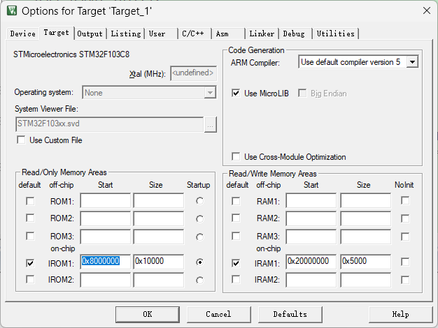
修改为 `0x08005000`

如果烧录出现 **# flash download failed-cortex M3**，可以尝试把 Debug->ST-Link->Setting->Flash Download 里的地址该为 `0x08005000` 试一下
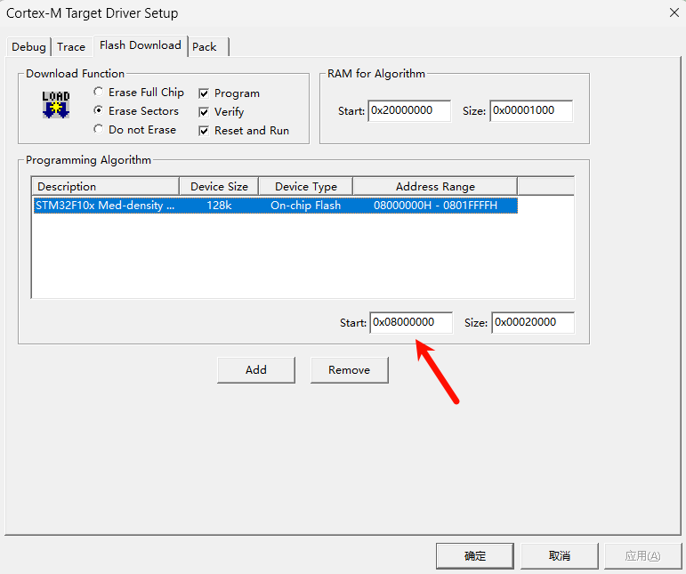

#### **设置 APP 向量表**
**方法 1**：修改 `Start\system_stm32f10x.c`  里的 `#define VECT_TAB_OFFSET  0x0` 为 `0x5000`，这里 `0x5000` 是相对于 `0x08000000` 的偏移地址。
**方法 2**：在 APP 代码的最开始设置 `SCB->VTOR = 0x08005000;`
#### 代码
**OTA_A 代码**
```c
#include "stm32f10x.h" // 设备头文件
#include <stdio.h>
#include "Delay.h"
#include "OLED.h"
#include "UserUSART.h"
#include "Log.h"

void USART1_IRQHandler(void);

uint32_t i, j;

int main(void)
{
    SCB->VTOR = 0x08005000; // 如果没修改 Start\system_stm32f10x.c  里的 #define VECT_TAB_OFFSET  0x0 为 0x5000
    User_USART_Init();
    printf("APP running!\r\n");
    while (1)
    {
        if (UxCB.URxDataOUT != UxCB.URxDataIN) // 有数据可读
        {
            printf("Received data %d bytes: ", UxCB.URxDataOUT->end - UxCB.URxDataOUT->start + 1);
            for (uint8_t *ptr = UxCB.URxDataOUT->start; ptr <= UxCB.URxDataOUT->end; ptr++)
            {
                printf("%c", *ptr);
            }
            UxCB.URxDataOUT++; // 指向下一个段的地址
            if (UxCB.URxDataOUT == UxCB.URxDataEND)
                UxCB.URxDataOUT = &UxCB.URxDataPtr[0]; // 移动到第一个段的地址
        }
    };
}

// TODO 修改为对应的USARTx中断处理函数
void USART1_IRQHandler(void)
{
    USARTx_IRQHandler();
}

```
**OTA_B 代码**
```c
#include "stm32f10x.h"
#include <stdio.h>
#include "UserUSART.h"
#include "Log.h"
#include "BOOT.h"
#include "main.h"

void USART1_IRQHandler(void);

ota_info_t g_ota_info = {OTA_FLAG_STATE_VALID};
uint32_t i, j;

int main(void)
{   
    User_USART_Init();
    printf("BootLoader Start!\r\n");
    BootLoader();
    while(1)
    {

    }
}

// TODO 修改为对应的USARTx中断处理函数
void USART1_IRQHandler(void)
{
   USARTx_IRQHandler();
}

```

BOOT.c
```c
#include "stm32f10x.h" // 设备头文件
#include <stdio.h>
#include "Delay.h"
#include "OLED.h"
#include "UserIIC.h"
#include "UserUSART.h"
#include "AT24C256.h"
#include "FLASH.h"
#include "Log.h"
#include "main.h"
#include "BOOT.h"


AppEntryFunc g_appEntry = NULL;

void BootLoader(void)
{
    if (g_ota_info.ota_flag == OTA_FLAG_STATE_VALID){
        BootJumpToApp(STM_APP_BASE_ADDR);
    }else{
        LOG("Keep BootLoader!\r\n");
    }
}

/* 设置 MSP 的汇编函数 */
__asm void SetMainStackPointer(uint32_t stackAddr)
{
    MSR MSP, r0        ; MSP = r0
    BX  lr             ; return
}

void BootClearAppEntry(void);
/* 跳转到应用程序入口 */
void BootJumpToApp(uint32_t appBaseAddr)
{
    /* 1. 判断栈顶地址有效性（SRAM 范围） */
    uint32_t appStack = *(uint32_t *)appBaseAddr; // 从地址 appBaseAddr 取出应用程序栈顶地址
    uint32_t appResetHandler = *(uint32_t *)(appBaseAddr + 4);

    if (appStack < 0x20000000 || appStack > 0x20004FFF)
    {
        LOG("ERROR: Invalid application stack pointer: 0x%08X\r\n", appStack);
        return;
    }

    BootClearAppEntry();

    /* 2. 关闭所有中断 */
    __disable_irq();

    /* 3. 设置 MSP */
    SetMainStackPointer(appStack);

    /* 4. 设置向量表偏移 */
    // SCB->VTOR = appBaseAddr; 无效， APP加载后会被覆盖

    /* 5. 跳转到应用程序的 Reset_Handler */
    g_appEntry = (AppEntryFunc)appResetHandler;

    __enable_irq();  // 开启全局中断

    g_appEntry();
}

/* ===============================
   GPIOx -> RCC_APB2Periph_GPIOx 映射函数
   =============================== */
static uint32_t GPIOxToRCC(GPIO_TypeDef *GPIOx)
{
    if (GPIOx == GPIOA) return RCC_APB2Periph_GPIOA;
    if (GPIOx == GPIOB) return RCC_APB2Periph_GPIOB;
    if (GPIOx == GPIOC) return RCC_APB2Periph_GPIOC;
    if (GPIOx == GPIOD) return RCC_APB2Periph_GPIOD;
    if (GPIOx == GPIOE) return RCC_APB2Periph_GPIOE;
    return 0; // 无效
}


/**
 * @brief  清理外设状态，避免 Bootloader 跳转到应用程序后外设冲突
 * @note   清理完成后关闭对应 GPIO 时钟
 */
void BootClearAppEntry(void)
{
    uint32_t rcc_gpio;

    /* ===========================
       USART 清理
       =========================== */
    #ifdef GPIOx_USART
            rcc_gpio = GPIOxToRCC(GPIOx_USART);
            if (rcc_gpio)
            {
                RCC_APB2PeriphClockCmd(rcc_gpio, ENABLE);
                #ifdef USARTx
                        USART_DeInit(USARTx);
                #endif
                #ifdef USART_DMA_TX_CH
                        DMA_Cmd(USART_DMA_TX_CH, DISABLE);
                #endif
                #ifdef USART_DMA_RX_CH
                        DMA_Cmd(USART_DMA_RX_CH, DISABLE);
                #endif
                #ifdef USARTTx
                        GPIO_ResetBits(GPIOx_USART, USARTTx);
                #endif
                #ifdef USARTRx
                        GPIO_ResetBits(GPIOx_USART, USARTRx);
                #endif
                        RCC_APB2PeriphClockCmd(rcc_gpio, DISABLE);
            }
    #endif

}


```

# 下载和更新
## w25Q64 和 FLASH
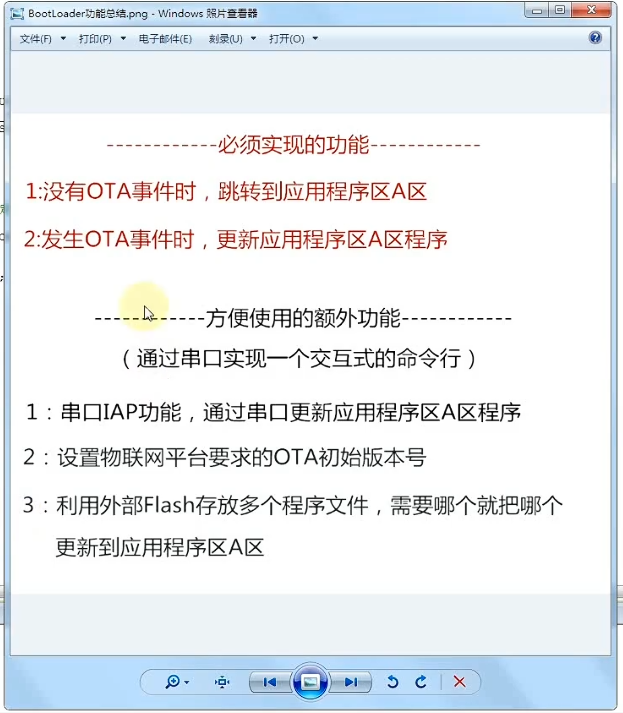

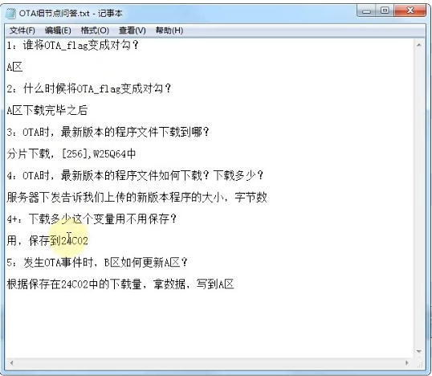

```c
if (g_boot_flag & BOOT_FLAG_UPDATE_A){
	// 更新应用程序
	// BootUpdateApp();
	printf("BootUpdateApp()\r\n");
	uint32_t block_num = g_boot_update.w25q64_block_num;
	uint32_t file_len = g_ota_info.ota_file_len[block_num];
	if(file_len % 4 == 0){
		printf("OTA update file length: %d bytes\r\n", file_len);

		// FLASH 每页 1024 字节 FLASH_PAGE_BYTE_NUM
		// W25Q64 每页 256 字节 W25Q64_PAGE_SIZE
		// W25Q64 每块(64*1024) 字节（64KB） W25Q64_BLOCK_SIZE,

		// 擦除 FLASH 所有页
		UserFLASH_ErasePage(STM_APP_BASE_PAGE_NUM, STM_APP_PAGE_NUM); 
		for(i = 0; i < file_len / FLASH_PAGE_BYTE_NUM; i++){
			// 从 W25Q64 读取 FLASH_PAGE_BYTE_NUM 个字节的数据
			W25Q64_Read(g_boot_update.update_buff, i * FLASH_PAGE_BYTE_NUM + block_num * W25Q64_BLOCK_SIZE, FLASH_PAGE_BYTE_NUM);
			// 每次写入 一个页 = FLASH_PAGE_BYTE_NUM 个字节
			User_FLASH_WriteFromPage(STM_APP_BASE_PAGE_NUM + i, (uint32_t *)g_boot_update.update_buff, FLASH_PAGE_BYTE_NUM);
		}
		if(file_len % FLASH_PAGE_BYTE_NUM != 0){
			// 不满足页写的字节数，需要单独处理
			// 从 W25Q64 读取 file_len % FLASH_PAGE_BYTE_NUM 个字节的数据
			W25Q64_Read(g_boot_update.update_buff, i * FLASH_PAGE_BYTE_NUM + block_num * W25Q64_BLOCK_SIZE, file_len % FLASH_PAGE_BYTE_NUM);
			// 每次写入 file_len % FLASH_PAGE_BYTE_NUM 个字节
			User_FLASH_WriteFromPage(STM_APP_BASE_PAGE_NUM + i, (uint32_t *)g_boot_update.update_buff, file_len % FLASH_PAGE_BYTE_NUM);
		}
		if (block_num == 0){
			g_ota_info.ota_flag = OTA_FLAG_INVALID; // 升级完成后，将标志位设为无效
			AT24C256_WriteOtaInfo(); // 写入 OTA 标志位和文件长度
		}
		NVIC_SystemReset(); // 复位系统，按了一次复位键
	}else
	{
		printf("OTA update file bytes length is not multiple of 4.\r\n");
		g_boot_flag &= ~BOOT_FLAG_UPDATE_A;
	}
}
```

## ITA （Xmodem）
有效数据 128 字节，整包 128 + 5 字节
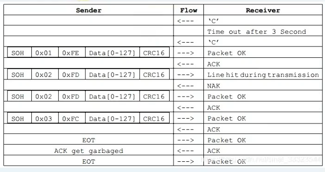
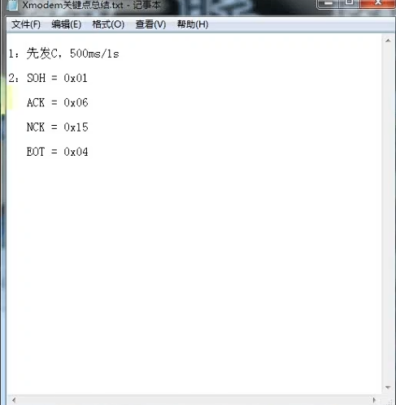
### CRC
#### 示例
CRC 的数学本质：CRC-16/XMODEM 是用  「**消息多项式 × x¹⁶**」  ，去除以生成多项式 0x1021，得到的 16 位余数。

CRC = 用生成多项式 G(x) 对消息多项式 M(x)·x¹⁶ 做模 2 除法的余数
- 运算域：**GF(2)**（只有 0/1，加法 = XOR）
- XMODEM 的生成多项式：
	$G(x)=x^{16}+x^{12}+x{5}+1$
	对应二进制 `1 0001 0000 0010 0001  => 0x1021`

示例数据：1 字节
```c
data = 0x31   // ASCII '1'
```
二进制：
```c
0x31 = 0011 0001
```
把数据 **左移 8 位对齐到 CRC 的高位**，等价于：$M(x)⋅x^8$
```c
crc = (*data << 8) ^ crc;
// crc = 0x3100 
// 0011 0001 0000 0000
```
进入 bit-by-bit 除法（8 次）
```c
0011 0001 0000 0000
^
| MSB = 0
```
1. 第 1 bit 运算
	```c
	if (crc & 0x8000)   // MSB?， 0x8000 = 1000 0000 0000 0000
	crc <<= 1;
	// 0110 0010 0000 0000
	```
2. 第 2 bit，MSB = 0 → 继续左移，`crc = 1100 0100 0000 0000`
3. 第 3 bit，MSB = 1 → 左移 + 异或 poly
	左移：
	`1000 1000 0000 0000`
	异或 `0x1021`：
	```c
	 1000 1000 0000 0000
	^0001 0000 0010 0001
	-------------------
	 1001 1000 0010 0001
	```
4. 第 8 bit 结束

5. 8 次循环结束后，CRC 的值就是：
	**消息 `0x31` 对多项式 `0x1021` 的模 2 余数**


#### 原理
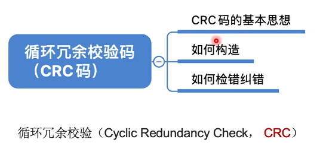
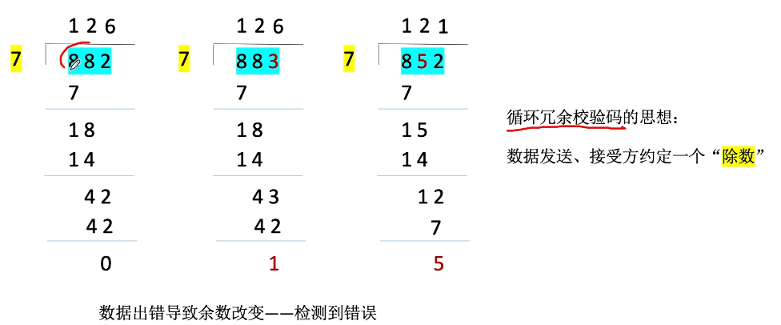
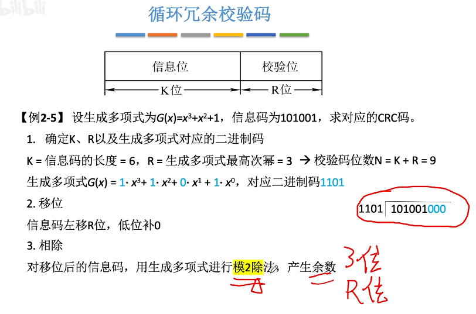
模 2 减：异或
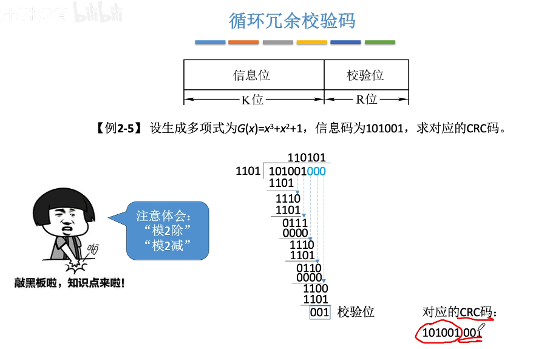
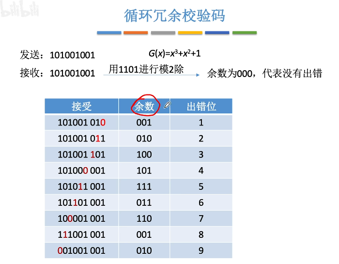

CRC 初始值
- XMODEM 规定 CRC 初值为 `0x0000`
按字节处理数据
```c
for (uint16_t i = 0; i < len; i++)
```
- CRC-16/XMODEM 是 **按字节顺序处理**
- 每个字节等价于连续处理 8 个 bit
高低字节交换，CRC 多项式运算是 **MSB 先行**
```c
crc = (crc >> 8) | (crc << 8);
// 将“下一个输入字节”与 CRC 的高字节对齐
// 等价： crc ^= data[i] << 8; 
```
将当前数据字节混入 CRC
```c
crc ^= data[i];
```
- 把输入数据并入 CRC 寄存器
- 等价于 **多项式“减去”当前数据**
- 在 GF(2) 中，“减法 = 异或”
低 8 位右移 4 位并异或
```c
crc ^= (uint8_t)(crc & 0xFF) >> 4;
```
- 这是 **多项式 `0x1021` 的等价展开**
- 替代了 4 次 bit-by-bit 的移位+判断
- 本质是在模拟：
	```c
	if (bit) crc ^= poly;
	```
左移 12 位并异或
```c
crc ^= (crc << 12);
```
- 对应多项式中 **x¹² 项**    
- 是 `0x1021` 中高位部分的贡献    
- 替代多次移位判断
低 8 位左移 5 位并异或
```c
crc ^= ((crc & 0xFF) << 5);
```
- 对应多项式中 **x⁵ 项**
- 同样是 `0x1021` 展开的结果
- 再次减少 bit 运算次数

# 其他
## vscode 添加路径，无须到 keil，以及`USART1_IRQn` 报红
打开 `Project.uvprojx`
1. 在 `<Cads>` 的 `<IncludePath>` 添加对应路径
	```c
	<IncludePath>\UserLib\Src;.\UserLib\Inc</IncludePath>
	```
2. `<Groups>` 添加文件
	其中
	```c
	<FileType>1</FileType>   <!-- .c，参与编译 -->
	<FileType>5</FileType>   <!-- .h -->
	```
	添加
	```c
	<Group>
	  <GroupName>UserLib\Src</GroupName>
	  <Files>
		<File>
		  <FileName>UserUSART.c</FileName>
		  <FileType>1</FileType>
		  <FilePath>.\UserLib\Src\UserUSART.c</FilePath>
		</File>
		<File>
		  <FileName>Delay.c</FileName>
		  <FileType>1</FileType>
		  <FilePath>.\UserLib\Src\Delay.c</FilePath>
		</File>
		<File>
		  <FileName>UserIIC.c</FileName>
		  <FileType>1</FileType>
		  <FilePath>.\UserLib\Src\UserIIC.c</FilePath>
		</File>
		<File>
		  <FileName>AT24C256.c</FileName>
		  <FileType>1</FileType>
		  <FilePath>.\UserLib\Src\AT24C256.c</FilePath>
		</File>
	  </Files>
	</Group>
	<Group>
	  <GroupName>UserLib\Inc</GroupName>
	  <Files>
		<File>
		  <FileName>UserUSART.h</FileName>
		  <FileType>5</FileType>
		  <FilePath>.\UserLib\Inc\UserUSART.h</FilePath>
		</File>
		<File>
		  <FileName>Delay.h</FileName>
		  <FileType>5</FileType>
		  <FilePath>.\UserLib\Inc\Delay.h</FilePath>
		</File>
		<File>
		  <FileName>UserIIC.h</FileName>
		  <FileType>5</FileType>
		  <FilePath>.\UserLib\Inc\UserIIC.h</FilePath>
		</File>
		<File>
		  <FileName>AT24C256.h</FileName>
		  <FileType>5</FileType>
		  <FilePath>.\UserLib\Inc\AT24C256.h</FilePath>
		</File>
	  </Files>
	</Group>
	```
3. 重新选择目标，即可编译，前提（安装插件 `Keil Assistant`， `Keil uVision Assistant`）
	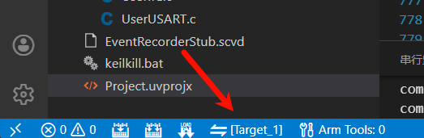
4. 解决 `USART1_IRQn` 报红
	在 `Project.uvprojx` 里搜索 `Define`，然后添加宏 `STM32F10X_MD`
	```c
	<Define>USE_STDPERIPH_DRIVER;STM32F10X_MD</Define>
	```
	或者.vscode\c_cpp_properties.json 添加 STM32F10X_MD
	```c
	"configurations": [
		{
			"defines": [
			     "USE_STDPERIPH_DRIVER;STM32F10X_MD",
			 ]
		}
	
	```

## vscode 双击文件设置不覆盖当前标签页
设置搜索 `enablePreview`，关闭


## Keil 烧录和Reset and Run 不起作用
1. Keil Reset and Run 不起作用：取消勾选 ST-Link 的 pack->Enable
	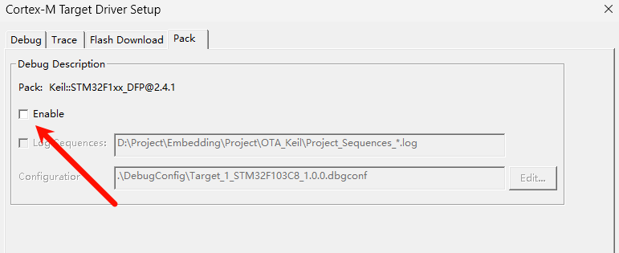
2. 烧录结果需要下一次才能执行：勾选 Use MicroLIB
	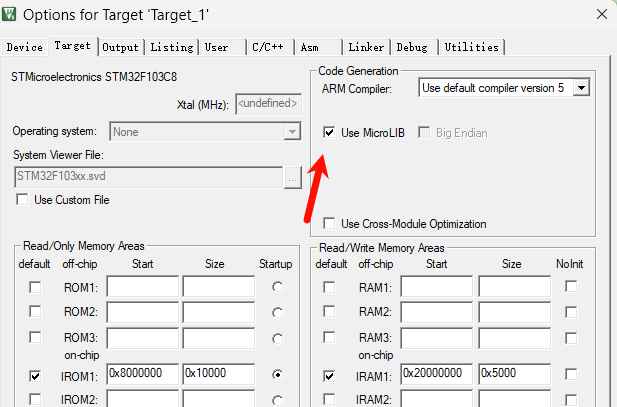

## 问题：USART 莫名其妙打印问号 `?` 或者 00
关于串口莫名其妙出现**问号**会打印 `?`
**如果是跳转 APP 时出现 `?`，在清理函数中**（跳转 APP 区前）
```c
// TC：Transmit Complete-发送完成,当TDR空且移位寄存器空时
while (USART_GetFlagStatus(USARTx, USART_FLAG_TC) == RESET);
```
**如果是 bootloader 开始时出现**
解决方案，先 `USART_Init()`，再 `GPIO_Init()`
```c
if (USARTx == USART1)
    RCC_APB2PeriphClockCmd(RCC_APB2Periph_USART1, ENABLE);
else if (USARTx == USART2)
    RCC_APB1PeriphClockCmd(RCC_APB1Periph_USART2, ENABLE);
else if (USARTx == USART3)
    RCC_APB1PeriphClockCmd(RCC_APB1Periph_USART3, ENABLE);

USART_InitTypeDef USART_InitStruct = {0};
USART_InitStruct.USART_BaudRate = 115200;
USART_InitStruct.USART_HardwareFlowControl = USART_HardwareFlowControl_None;
USART_InitStruct.USART_Mode = USART_Mode_Tx | USART_Mode_Rx;
USART_InitStruct.USART_Parity = USART_Parity_No;
USART_InitStruct.USART_StopBits = USART_StopBits_1;
USART_InitStruct.USART_WordLength = USART_WordLength_8b;
USART_Init(USARTx, &USART_InitStruct);

if (GPIOx_USART == GPIOA)
    RCC_APB2PeriphClockCmd(RCC_APB2Periph_GPIOA, ENABLE);
else if (GPIOx_USART == GPIOB)
    RCC_APB2PeriphClockCmd(RCC_APB2Periph_GPIOB, ENABLE);
else if (GPIOx_USART == GPIOC)
    RCC_APB2PeriphClockCmd(RCC_APB2Periph_GPIOC, ENABLE);

GPIO_InitTypeDef GPIO_InitStruct = {0};
GPIO_InitStruct.GPIO_Mode = GPIO_Mode_AF_PP;
GPIO_InitStruct.GPIO_Pin = USARTTx;
GPIO_InitStruct.GPIO_Speed = GPIO_Speed_50MHz;
GPIO_Init(GPIOx_USART, &GPIO_InitStruct);
GPIO_InitStruct.GPIO_Mode = GPIO_Mode_IPU;
GPIO_InitStruct.GPIO_Pin = USARTRx;
GPIO_InitStruct.GPIO_Speed = GPIO_Speed_50MHz;
GPIO_Init(GPIOx_USART, &GPIO_InitStruct);

```
### 解释：
1、先初始化 GPIO
```c
GPIO_InitStruct.GPIO_Mode = GPIO_Mode_AF_PP;
GPIO_InitStruct.GPIO_Pin  = USARTTx;
GPIO_Init(GPIOx_USART, &GPIO_InitStruct);
```
此时：
- USART 还没有使能 (`USART_Cmd(USARTx, ENABLE)` 还没执行)
- TX 引脚切换到 AF_PP 后，其默认输出值 **不由 USART 控制**，而由 GPIO AF 配置逻辑初始值决定

TX 引脚在 GPIO 初始化过程中产生的低电平毛刺被对端串口误判为一个字节，为什么只有 TX（发送脚）会触发这个问题，TX 在 UART 空闲状态下应保持高电平。但在配置 AF_PP 之前或期间，TX 可能：
- 被 GPIO 默认驱成低电平
- 或进入 Hi-Z 后又被上下拉影响
- 或被 ST 的复用层逻辑短暂接管
任何**低电平持续超过 1/16 bit 时间**，上位机都会识别成 UART Start Bit。

UART 协议中：
- **Idle = 高电平**
- **Start bit = 低电平**

2、然后初始化 USART
```c
USART_Init(USARTx, &USART_InitStruct);
USART_Cmd(ENABLE);
```
后面立即恢复高电平（因为 TX 默认空闲为高） → 8 个采样点都是高，然后帧内其他 8 bit 都是高电平，于是得到：`0000 0000`

RX 配置为 `GPIO_Mode_IPU`，即：
- 输入模式
- 内部上拉
不会主动驱动线，所以不会产生干扰。

## temp